# PTP Time Synchronization — Concept and Results

## 1 Precision Time Protocol IEEE 1588 Overview

The Precision Time Protocol (PTP) is a protocol for clock synchronization throughout a computer network with relatively high precision as compared to using the earlier developed Network Time Protocol (NTP) and therefore potentially higher accuracy depending on the configuration. In a local area network (LAN), accuracy can be sub-microsecond -- making it suitable for measurement and control systems applications.

PTP can be used to synchronize financial transactions, mobile phone tower transmissions, sub-sea acoustic arrays, and networks that require precise timing as an alternative to using the timestamp of satellite navigation signals or where sub-microsecond accuracy as provided by the White Rabbit Project is unnecessary.

### 1.1 Architecture

The IEEE 1588 standard uses a master-slave setup to distribute time across a network.

Clock Types in PTP

- **Ordinary Clock**: A device with just one network connection. It acts either as the source of time (the master) or the receiver of time (the slave).

- **Grandmaster Clock**: The ultimate root time source for the entire network.

- **Boundary Clock**: A device with multiple network connections that sits between different network segments. It syncs to a master clock on one side and acts as a master clock to slaves on the other side.

- **Transparent Clock**: A feature built into network switches or routers. As time messages pass through the switch, this clock measures exactly how long the message took to travel through the hardware and updates the message data. This removes network delays and improves accuracy.

### 1.2 The 64-Bit Linux Clock vs. 80-Bit Hardware PTP Clock

The standard Linux clock tracks time by counting seconds since January 1, 1970. It uses a 64-bit software counter that splits time into seconds and nanoseconds. This counter ticks forward based on signals from the computer's built-in silicon crystal. While this clock can count billions of years into the future, its accuracy is stuck at the millisecond level. This is because standard software is prone to operating system delays, and the silicon crystal naturally drifts as the computer warms up or cools down.

The Precision Time Protocol (PTP) uses a high-resolution 80-bit hardware clock value split into two layers: a 48-bit section that counts whole seconds (up to 8.9 Million years) and a 32-bit section that counts nanoseconds. The nanosecond layer counts up and resets to zero the exact moment it hits 1,000,000,000, adding one second to the 48-bit counter.

To sync the Beagleplay's internal clock, a u-blox GPS module tracks satellites and sends a sharp physical pulse (PPS) every second into a GPIO pin. The Linux pps-gpio driver catches this interrupt instantly and acts passes it onto the chrony. It compares the pulse against the 80-bit clock, using the Proportional part to snap nanosecond error to zero and the Integral part to adjust clock frequency, neutralizing silicon crystal drift.

Because the board's internal CPU clock and the network card (NIC) hardware clock are entirely separate, the NIC (like the Texas Instruments **Realtek RTL8211F-VD-CG**) handles the network side. The instant a PTP packet touches the Ethernet wire, the NIC hardware stamps it with its own 80-bit time, bypassing OS lag. A PTP daemon (phc2sys) constantly copies the GPS-synced internal time down to this NIC hardware clock, keeping all network cameras and nodes in perfect sub-microsecond alignment.

### 1.3 PTP Message Types

Precision Time Protocol (PTP) keeps a network synchronized by exchanging two main classes of network messages:

#### 1.3.1. Event Messages (Time-Critical)

These messages require exact hardware timestamping the instant they touch the network cable. Their precision directly affects synchronization accuracy:

- **Sync & Delay_Req**: Used by standard master and slave clocks to calculate network travel delays and sync time.

- **Pdelay_Req & Pdelay_Resp**: Used by newer Transparent Clocks (PTPv2) to measure delays between specific connected links.

#### 1.3.2 General Messages (Information-Only)

These are standard data packets where the information inside matters, but their exact arrival or departure time does not need to be stamped:

- **Follow_Up & Delay_Resp**: Provide the backup timestamp data for the corresponding event messages.

- **Announce**: Used by the system's algorithm to choose the best master clock (the Grandmaster).

- **Management & Signaling**: Used to configure, monitor, and maintain communication between clocks.

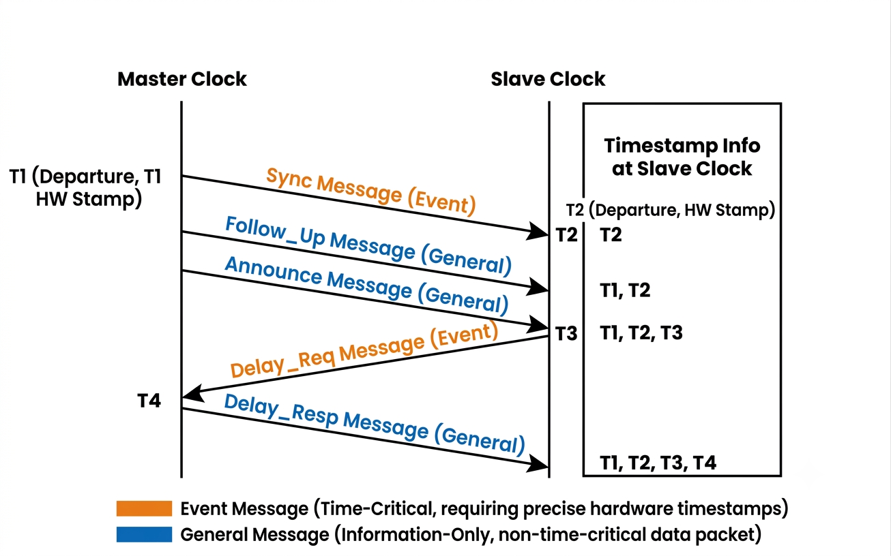

> *NTP and PTP use the same four-timestamp synchronization methodology to calculate offset and delay. What differentiates them is that PTP applies hardware-based timestamping to Event messages specifically, whereas NTP applies software-based timestamping uniformly across all messages.*

### 1.4 How the System Stays Synced: Delay Calculations and Clock Control using ptp4l and phc2sys applications

To run the math loop and adjust the hardware clocks automatically, the system uses three standard Linux software applications working together: chrony , phc2sys and ptp4l.

- **The chrony Application:** This software disciplines the computer's internal CPU clock using a software-based PI controller. On the Grandmaster, it takes its reference time from gpsd to correct the CPU clock against the GPS signal.

- **The phc2sys Application:** This software acts as an internal bridge between the computer's CPU clock and the NIC's hardware clock, behaving like a software-based PI controller. Because these two clocks are physically separate and tick independently, phc2sys constantly transfers time between them. On the Grandmaster, it copies the GPS-disciplined CPU clock forward onto the NIC hardware clock so accurate time can be broadcast out to the network. On a Slave, the direction reverses --- it copies the network-synchronized NIC hardware clock back and disciplines the CPU clock.

- **The ptp4l Application:** This software handles the network side. It sends and receives the timing packets over the Ethernet cable, calculates the network delays, and figures out the time error between the master and follower.

While the basic PTP messages (Section 1.3) and the 80-bit counters (Section 1.2) handle the data, the system needs a continuous math loop to stay perfectly accurate. Because network traffic changes every millisecond and silicon chips drift as they warm up, the software constantly calculates wire delays and adjusts the systems internal time.

#### 1.4.1 Measuring Cable Delay

To find the true time error between the Master and Follower, the system must separate network travel time from actual clock drift. It does this by measuring how long a packet takes to cross the Ethernet cable using a four-timestamp handshake:

**Mean Path Delay = { ( t2 - t1 ) + ( t4 - t3 ) } / 2**

Once it knows the travel time (for example, exactly 120 ns ), the software strips this delay away from the raw packet arrival time to find the true clock error:

**Time offset = { ( t2 - t1 ) - Mean Path Delay }**

- **(t2 - t1):** This is the raw time gap between when the master sent the packet ($t_1$, found in the Follow_Up message) and when the follower's network card stamped it ($t_2$). This raw number includes both the actual clock error and the time spent traveling in the wire.

- **- Mean Path Delay:** By subtracting the wire travel time, the software removes network delivery delays entirely.

> The result is the **True Time Offset**---a pure measurement of exactly how many nanoseconds the follower's clock is ahead or behind the master.

#### 1.4.2 The Software Control Loop (The PI Controller)

> This isolated Time Offset is instantly sent to the software PI controller loop. The tuning settings of this controller---the Proportional (Kp) and Integral (Ki) settings---stay exactly the same to keep the system stable. The software does not change these settings; instead, it uses them to calculate a speed adjustment command in Parts Per Billion (PPB)
>
> **Frequency Adjustment (PPB) = (Kp × Offset) + (Ki × ∫Offset)**

- The Proportional Part (Kp): Reacts instantly to every single packet to handle sudden, short-term network bumps.

- The Integral Part (Ki): Watches a history cycle of multiple packets to detect and fix long-term crystal drift caused by temperature changes.

#### 1.4.3 Adjusting the Hardware Counter

At the lowest layer, this speed command controls the physical hardware. The **pps-gpio driver** acts as a software wrapper. It catches the precise electrical voltage pulse from the GPS module on a GPIO pin and turns it into a high-priority interrupt that the Linux kernel processes instantly.

The software takes the PPB correction speed from the PI loop and writes it directly into the network card's physical clock chip. If the math shows the follower clock is running a tiny bit too fast, the hardware register lowers its frequency. This slows down how fast the **80-bit PTP counter** ticks, smoothly pulling the follower node back into perfect, sub-microsecond alignment with the Grandmaster reference clock.

## 2 Implementation

### 2.1 Hardware Interfacing & The pps-gpio Software Wrapper

To build an ult ra-precise network time master, the hardware wiring was split into three simple layers. These layers handle everything from setting the clock when the system first turns on, to keeping it accurate down to the microsecond, and finally, testing the speed with an oscilloscope.

**1: The Serial Connection for Rough Time Data (NMEA Strings)**

The first physical layer connects the u-blox GPS module to the Beagleplay board using standard serial communication wires (UART).

The GPS module continuously streams standard text sentences, called NMEA strings, over these serial wires. These text sentences contain basic calendar information including the current year, month, day, hour, minute, and second.

However, because serial text data moves relatively slowly and suffers from software delays inside the operating system, it cannot be used for high-precision timing. It tells the system which second it is, but it cannot pinpoint the exact beginning of that second.

**2: The Physical Pulse Connection (PPS to GPIO)**

To get microsecond accuracy, a second physical wire was run from the GPS module's PPS (Pulse-Per-Second) pin straight into a hardware input pin (GPIO) on the Beagleplay.

At the exact turnover of every single second, the GPS module sends a sharp, instant electrical voltage spike down this wire. Because a standard operating system cannot natively read a raw electrical pulse as time data, the Linux kernel's pps-gpio driver was used as a software wrapper.

The instant the voltage spike hits the pin, this driver triggers a top-priority hardware interrupt. This bypasses all standard operating system delays and lets the kernel log the exact start of the second instantly.

Cold-Start Synchronization (First Boot)

When the system first turns on from being completely powered off, which is known as a cold start, the internal clock is completely wrong. The system combines Layer 1 and Layer 2 to fix this.

First, the system performs a rough adjustment by reading the incoming NMEA text string from the serial wires to learn the general time, such as discovering it is exactly 2:15:32 PM. It uses this data to set the seconds part of the clock.

Second, the system performs a fine adjustment. Once the general second is set, the system immediately waits for the next incoming PPS electrical pulse. The instant that pulse hits the hardware pin, the system snaps the nanoseconds part of the internal clock straight to zero. This two-step process completely cleans up any startup errors, giving the system a perfectly accurate baseline before the network camera synchronization loop even starts.

**3 Hardware Testing via timerfd at boundary of each second**

To prove that the cameras were actually synchronizing at a sub-microsecond level, a third hardware layer is built purely for testing and verification.

During the test setup, once the network synchronization was fully running, a test program is written where the master clock and the slave clock both generate a GPIO output at the start of each second on basis of CLOCK_REALTIME or system internal clock .

For the hardware execution, the program is written using timerfd. This program is supposed to claim a GPIO pin on both boards and timerfd is supposed to generate these pulses every second , the way you set this is by pps-pulser program where you can define starting delay , seconds between each pulse and total no. of times to generate these pulses. Since all the boards are supposed to generate these pulses at the boundary of a second you can directly measure the accuracy of clock between the two devices. You will have to set the pins for other boards GPIO pins for beagleplay (MIKROBUS_GPIO3_12 or RST pin) and beagleboneblack (P9_12 or GPIO 60) are already set.

For the final oscilloscope measurement, this output pin was physically wired directly to a OpenHentek6022BL digital oscilloscope at timebase of 20us . By comparing the physical electrical pulse from the Master clock side-by-side with the physical pulse from the Follower clock on the oscilloscope screen, the actual time difference could be measured visually.

### 2.2 Choosing the C Library: musl vs. glibc

Every Linux operating system uses a core piece of software called a standard C library (libc). This library acts as the main bridge between your programs and the computer's kernel engine. Whenever a program wants to use memory, print text, or ask a hardware clock for a timestamp, it must send that request through this library first.

While normal Linux systems use a library called glibc, a high-precision real-time system needs something much more predictable. To stop unpredictable software delays from ruining our timing, this project replaces glibc with musl, a lightweight library built specifically to keep embedded hardware running smoothly and predictably.

Swapping out glibc for musl gives our system three major advantages.

The first advantage is the elimination of software jitter. Standard glibc is built to handle everything from web browsers to massive supercomputers, making its internal code very large and complex

The second advantage is predictable memory control. Standard glibc constantly shuffles and rearranges memory chunks behind the scenes to help big applications move massive amounts of data. This shuffling can cause sudden, random pauses. The musl library handles memory in a clean, quiet way that avoids these random background pauses, keeping the processor entirely focused on our timing tasks.

The third advantage is less operating system overhead. The glibc library is structurally massive and loads thousands of desktop features we do not need into the system's memory. The musl library is stripped down to a fraction of that size. By removing all of this extra desktop bloat, the computer uses less processing power on baseline operating system chores and can prioritize our time-critical network tasks instead.

### 2.3 Kernel Optimization and Real-Time Patching

**Using musl to Cross-Compile the System**

Building the custom operating system directly on our small Beagleplay would be way too slow. Instead, we use a desktop computer to build the software for the board, a process called cross-compiling. The Yocto Project manages this by creating a specialized build tool that links all our software to the lightweight musl library instead of standard, heavy desktop libraries.

First, the build tool sets up this musl configuration. Second, it compiles the core operating system engine, ensuring that the network card drivers and the pps-gpio time-tracking components are set up to communicate through these streamlined pathways. Third, it compiles our core timing applications---ptp4l, phc2sys, and gpsd---using those same settings.

Genimage Bundles all the required booting files , Kernel , device tree binary , uboot.env script along with the readonly rootfs into a single image.

**Kernel Optimization**

A standard operating system engine comes packed with thousands of generic features---like code for game controllers, Bluetooth, and sound cards and also includes features that support PTP and related drivers like pps-gpio which are usually turned off by default . To fix this, we use a built-in settings menu called **menuconfig using crosscompilation**.

Second, we turned on the precision timing tools. We navigated to the network settings and enabled **PTP Hardware Clock support**, which allows our software to use the timing chips inside our network card. We also enabled the **PPS wire tool**, allowing the system to listen to the physical pulse from the GPS module.

**Real-Time Kernel Patching (PREEMPT_RT)**

A standard operating system is built with a major flaw for precision timing: many of its internal modules are **non-preemptible** . This means that when the CPU is busy running its own internal tasks---like clearing out memory or managing background system storage---it locks itself down. Even if a high-priority event happens, like an electrical pulse hitting our GPS pin or a timing packet arriving from the network, the CPU cannot be interrupted. It forces our critical timing signals to sit in a queue and wait until the background task completely finishes.

**How PREEMPT_RT Solves the Problem**

The PREEMPT_RT patch works around this issue by fundamentally modifying the kernel's internal code. It takes almost all of those non-preemptible internal modules and forces them to be **preemptible**.

Under this real-time patch, the kernel can no longer lock out the processor. The instant a high-priority timing event occurs, the system is forced to drop whatever internal task it was executing, pause its own code mid-sentence, and instantly handle our timing signal from the GPS PPS signals.

**The New Problem Created by the Real-Time Patch**

While the PREEMPT_RT patch solves our timing problem, it creates a new challenge: **increased system overhead and lower overall data speed**.

Because the system is now constantly pausing tasks, saving their exact states, switching to high-priority timing tasks, and then switching back, the processor has to do a massive amount of extra bookkeeping. This constant context switching slows down the overall data throughput of the computer. While our timing becomes incredibly precise and predictable, the system becomes less efficient at handling large, generic data chores , so turning off unused kernel features could give a performance boost.

### 2.4 Core Third-Party Applications

To manage the synchronization data and adjust the hardware clocks automatically, the system relies on a specific set of software tools. While some of these tools run as standard programs on top of the operating system, others are embedded directly into the core kernel code.

**Built-In Kernel Driver: pps-gpio**

The foundation of our hardware time capture relies on pps-gpio, which is an in-tree kernel module. Being an "in-tree" module means this driver is written, maintained, and included directly inside the official Linux kernel source code by default. It is not an external piece of software that had to be downloaded or compiled separately. Instead, because it is built right into the kernel, we simply had to use menuconfig to activate it. This driver acts as a software wrapper that instantly catches the physical electrical voltage pulse from the GPS module on a designated hardware pin and turns it into a high-priority system interrupt.

**gpsd (GPS Daemon)**

The gpsd application is a background service that handles the serial communication layer with our u-blox GPS module. It continuously monitors the serial wires to capture the incoming NMEA text data strings. The primary job of gpsd is to parse these sentences, extract the correct calendar date and time structure (the year, month, day, hour, minute, and second), and feed this data to the system. This provides the rough time baseline needed to initialize our clock during a cold start.

**ptp4l (LinuxPTP Application)**

The ptp4l application is the core program that handles the network side of the Precision Time Protocol (PTP). It manages the delivery and receipt of the time-stamped network packets traveling over the Ethernet cable. Using these packets, ptp4l continuously runs the mathematical handshake to calculate network travel delays and figure out the exact time offset between the master and follower devices. It then feeds this time offset into a software PI controller loop to calculate necessary clock speed corrections.

**phc2sys**

The phc2sys application serves as an essential internal bridge within the system. Inside the computer, the hardware clock on the network interface card (NIC) and the system's internal operating system clock are physically separate and run on different timing crystals. The phc2sys program constantly monitors both clocks, calculating the difference between them, and copies the highly accurate, GPS-synced time over to the network card's hardware clock register. This ensures that the time being broadcasted out over the network to the cameras is perfectly anchored to our atomic GPS reference timeline.

## 3 Testing and Results

### 3.1 Software Stack Testing

It is critical to understand that a PTP Grandmaster (Master) and a PTP Slave operate in completely opposite ways.

In a PTP Slave configuration, the device receives precise time packets *from the network cable*; ptp4l captures that network time, updates the Network Interface Card (NIC), and then phc2sys copies that time *backwards* into the computer's CPU clock.

In our PTP Grandmaster configuration, the flow is completely reversed. The Grandmaster is the ultimate source of truth for the entire network. It pulls time from an absolute external source (GPS satellites) and pushes it *forward*---disciplining the CPU clock, copying it to the NIC, and broadcasting it out to the network cables. So the Software stack testing needs to be done in 2 phases first for master and then for the slave

### 3.2 Objective of the Software Stack Testing

Before deploying our precision timing system, we must verify the integrity of our custom software stack. Think of this pipeline as a digital relay race: time starts at a satellite in space and must pass through four distinct software layers before it ever reaches the physical network cable.

If even one software program drops the ball, lags, or miscommunicates, our synchronization chain breaks. Testing this stack---specifically by verifying the live **phc2sys log outputs**---proves in simple terms that our data highway is completely clear, operational, and free of processing blockages.

### 3.3 Grandmaster Architecture And Data flow

#### 3.3.1 gpsd : (To parse the NMEA data from the GPS module) & pps-gpio (sending highly precise interrupts spaced 1 sec apart)

Our onboard GPS module receives raw, complex satellite radio streams. gpsd acts as a translator. It intercepts these streams, extracts the precise atomic time data, and passes this clean information down to our clock manager using a shared memory highway inside the system RAM.

Complementing this, the **pps-gpio driver** acts as a precise physical metronome. While gpsd provides the correct time-of-day data, network and software delays can cause it to lag. To fix this, the pps-gpio driver listens to a dedicated physical wire connected directly to the GPS. Exactly once per second, the GPS sends a sharp electronic pulse down this wire. The driver catches this heartbeat instantly at the hardware level, giving our clock manager the exact nanosecond a new second begins.

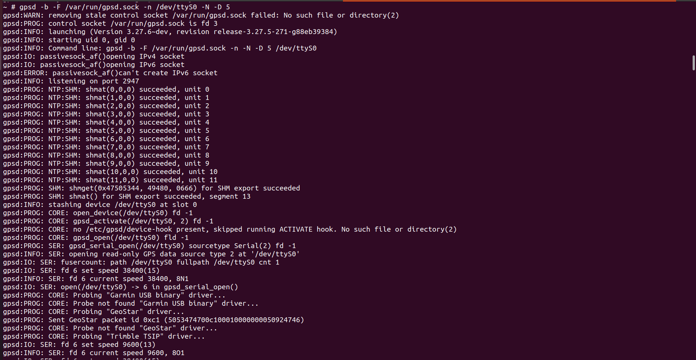

Through these logs we confirmed that the gpsd and pps-gpio daemons were correctly providing data to our system and can now be used for synchronization of internal system clock via chrony.

#### 3.3.2 chrony : (Clock bridge for system clock and gps)

The computer CPU's internal clock is notoriously imperfect and drifts due to temperature changes. chrony takes the clean atomic time from gpsd and uses it to constantly discipline , (speed up, or slow down) the internal CPU clock so it matches real-world time perfectly. Instead of making massive, erratic changes, it calculates the exact, minute frequency adjustments required to smooth out clock drift and lock the CPU clock to real-world atomic time.

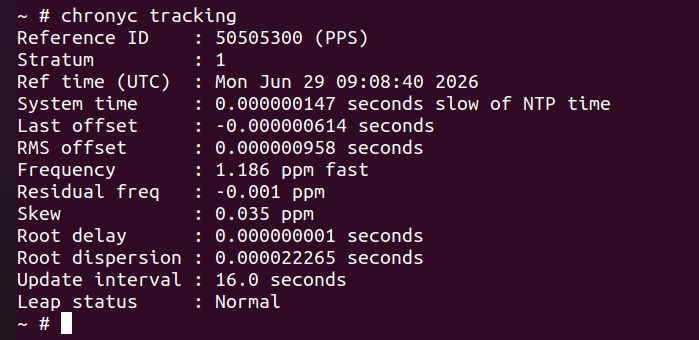

After 3-5 mins of chronyc sources locking down on GPS Chrony logs show that the system is successfully locked directly to a hardware PPS (Pulse Per Second) reference clock. The timekeeping is extremely tight, with an RMS offset of just ~2.16 microseconds. A steady 1.0-second update interval confirms the PPS signal is actively driving the Chrony daemon. The system clock is highly stable, showing a drift of just +0.002 ppm.

#### 3.3.3 phc2sys : (clock bridge for system clock and hardware clock in NIC)

Now we have a perfectly accurate CPU clock, but our Network Interface Card (NIC) uses its own separate hardware clock chip to handle incoming and outgoing network traffic. This is where phc2sys takes charge. It reads our newly disciplined CPU clock and uses those signals to discipline the NIC's hardware clock, ensuring both the processor and the network card are ticking at the exact same microsecond. Here phc2sys acts as a the PI controller.

The Servo Note: the (phc2sys) acts as a Software servo we use the stable results from chrony to adjust the internal physical hardware clock of the NIC. Unlike chrony phc2sys offer's an option which lets us decide how many times in a second we want to check and discipline the hardware clock inside the NIC for our particular use case we are doing 10 checks and discipline per second to make the NIC clock follow the system clock as closely as possible without causing OS jitter.

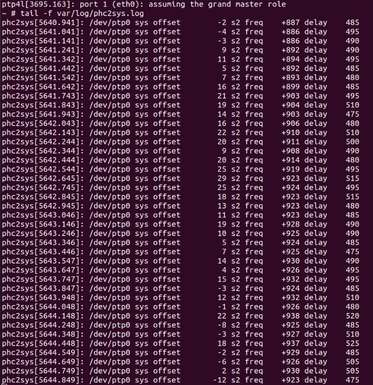

After few moments from startup the phc2sys process is actively synchronizing the system clock to the hardware clock (/dev/ptp0). The synchronization servo is in a locked state (s2). System time offsets are stable, ranging narrowly between -12 and 29 nanoseconds.

#### 3.3.4 ptp4l : (To start the PTP messaging services of the grandmaster node )

Finally, once the Network Card's hardware clock is perfectly aligned by the phc2sys servo, ptp4l turns on its messaging services. It packages that hyper-accurate hardware time into specialized PTP network packets and broadcasts them over the ethernet cable to synchronize all client devices on our local network.

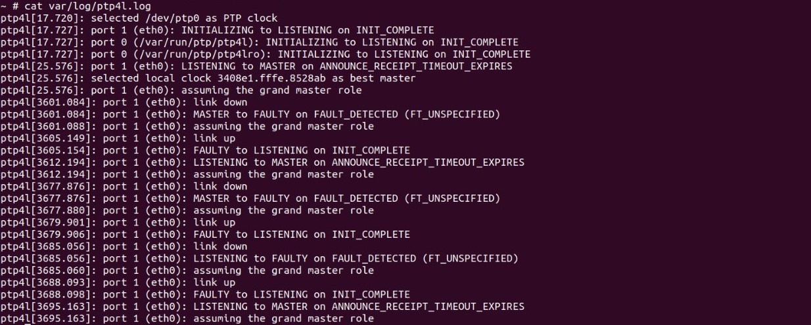

The constant link down error is because I had tried pull the cable out physically and check whether it would assume the grandmaster role again or not after it does happens.

#### 3.3.5 Conclusion Grandmaster

We have verified that the timing signals are successfully passing from GPS -> gpsd -> chrony ->CLOCK_REALTIME, and accuracy of each is being accurately printed in the logs. The Grandmaster software stack is fully verified, well within precision tolerances.

### 3.4 PTP Slave Architecture and Data Flow

The PTP Slave operates in the exact opposite direction of the Grandmaster. Instead of sending time out, it receives time from the network. It pulls precision time packets from the network cable and pushes them backward through the system: first updating the network card, then updating the computer's internal CPU clock, and finally smoothing it out for local applications.

#### 3.4.1 Network Packets via Ethernet port

The physical ethernet cable brings in highly accurate timing packets broadcast by the Grandmaster. These packets are the Slave's absolute source of truth.

#### 3.4.2 ptp4l (Adjusting the Network Card)

The ptp4l program reads the incoming network packets and calculates transmission delays. It uses this data to adjust and discipline the NIC (Network Interface Card) Hardware Clock, matching it perfectly to the network time.

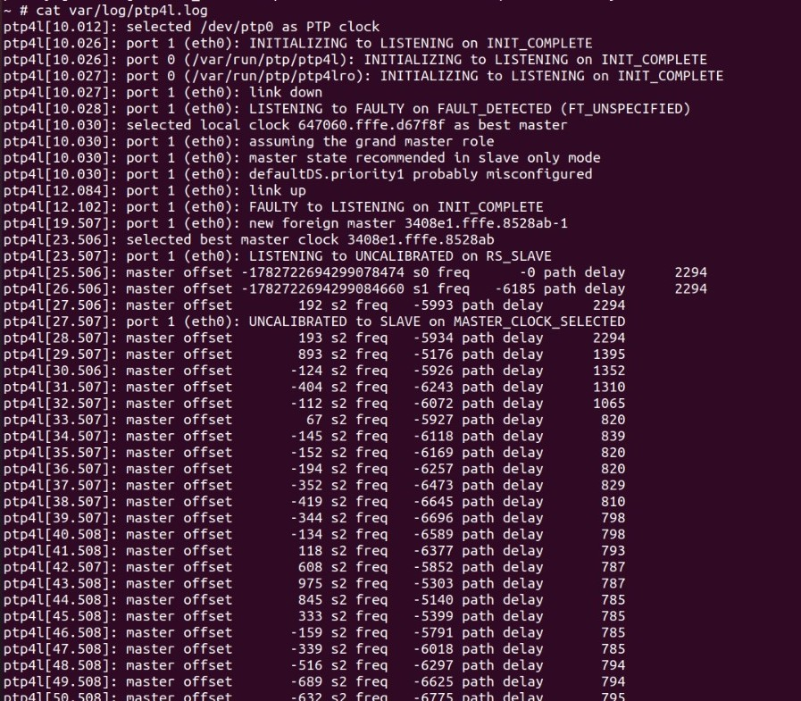

The ptp4l logs show INITIALIZING to LISTENING on INIT_COMPLETE confirms the network ports are up and actively listening for PTP announcement messages. new foreign master 000732.fffe.b8e11a-1 shows the clock has detected an external PTP Grandmaster clock identity on the network. selected best master clock 000732.fffe.b8e11a indicates the Best Master Clock Algorithm (BMCA) has chosen this specific Grandmaster as its time reference. LISTENING to UNCALIBRATED on RS_SLAVE means the device recognizes it must follow this master, but its internal time is not yet synced. UNCALIBRATED to SLAVE on MASTER_CLOCK_SELECTED marks the point where the clock servo takes control, establishing a formal Master-Slave tracking relationship.

Hence, the entire grandmaster clock is working , actively sending PTP packets to the slave inorder to synchronize it.

In starting you might see the errors because grandmaster logs show that it assumes the grandmaster roles at around 25 seconds and slave show that exact same thing by trying to calibrate around 25 seconds from starting itself

#### 3.4.3 phc2sys (The Clock Bridge)

The network card is now accurate, but the computer's main CPU clock still drifts. phc2sys acts as a bridge to fix this. Running on a Software PI controller , it checks the clocks 4 times per second. This high-speed servo copies the time backward from the NIC and uses it to discipline the main system CPU clock.

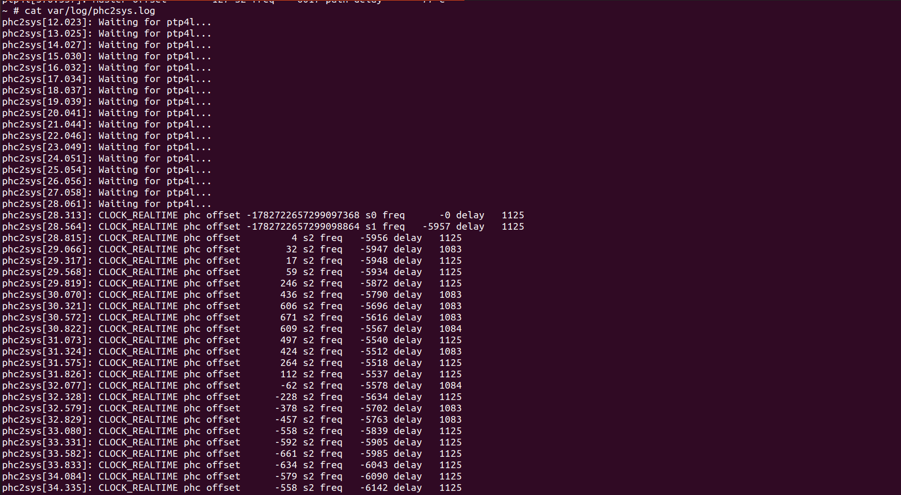

The phc2sys waits for the ptp4l to start synchronizing the clock before starting the CLOCK_REALTIME synchronization , on slave side phc2sys is doing the disciplining of the internal clock 4 times with very low Kp and Ki value inorder to make it more stable compared to making it being tightly able to follow the grandmaster clock.

#### 3.4.4 Conclusion Slave

Network port->ptp4l -> NIC Clock -> phc2sys -> system clock . The Slave stack is verified and fully synced with the Grandmaster.

### 3.5 Hardware Testing

#### 3.5.1 System Architecture and Priority Levels

To verify the time synchronization between the Grandmaster (GM) and Slave clocks, we must account for how the operating system schedules tasks. The software stack is split into two priority zones:

- **Kernel Space**: This layer has the highest priority. The pps-gpio driver runs here, allowing it to handle hardware interrupts instantly and pause all other software.

- **User Space**: This layer has standard priority. The four core time applications run here and must share CPU time sequentially in a specific order:

#### 3.5.2 Signal Generation

Hardware verification is performed by measuring physical signal pulses from both nodes on an oscilloscope. Both the Grandmaster and Slave are programmed to output a 30ms wide pulse exactly 1 second apart at the time specified by the pps-pulser's starting delay

#### 3.5.3 Grandmaster Signal Path

The Grandmaster uses the native echo-pin feature built into the pps-gpio kernel driver. Because this runs at the kernel level, the pulse fires instantly at the exact start of the second. The hardware pin goes high before gpsd or any other user-space application can execute code.

Both Master and Slave pps-pulser programs lacks a kernel-level echo driver, so a custom user-space module generates these pulses. When the target timestamp arrives, this module attempts to pull its pin high. However, because it runs in user space this program is going to face context switch delays and other operating system delays.

### 3.6 Oscilloscope Data Analysis and Final Conclusion

Oscilloscope measurements show a distinct time gap between the Grandmaster pulse and the Slave pulse.

- **Clock Accuracy**: This gap does not indicate a clock synchronization error. The underlying hardware clocks remain synchronized.

- **Source of Latency**: The oscilloscope is measuring user-space scheduling delay. The observed gap represents the exact execution time required by the Slave CPU to process ptp4l, phc2sys before the custom module is permitted to toggle the physical pin.

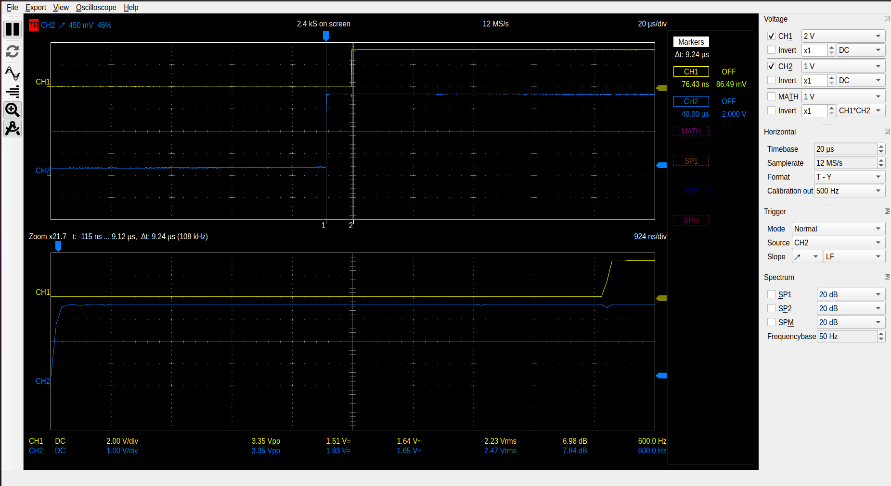

This reading shows the difference between grandmaster's timerfd gpio output (Yellow) and the pps echo output(Blue) , with an average of around 10 us with +- 3 us of jitter as both are running on the same device and the timerfd is userspace program whereas the pps-echo is generated by a kernel space program.

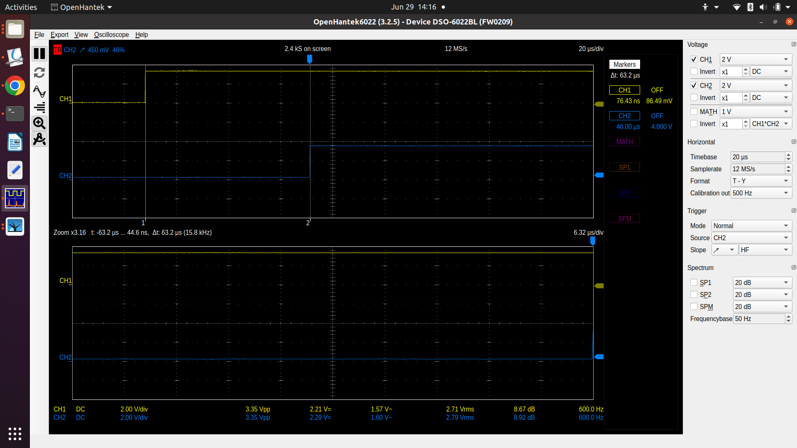

This screen shot shows a difference between grandmaster(Yellow) and salve's (Blue) timerfd output when the ppsctl pin was still configured to generate the output you will notice here that while the delay between master and slave is noticeably more but the jitter in the pulses is much higher and unpredictable which sometimes goes as high as 20 us. This is because since pps-echo is a kernel space driver it was actively hogging CPU cycles in order to generate the pps-echo pulses while the timerfd happens to be a userspace application.

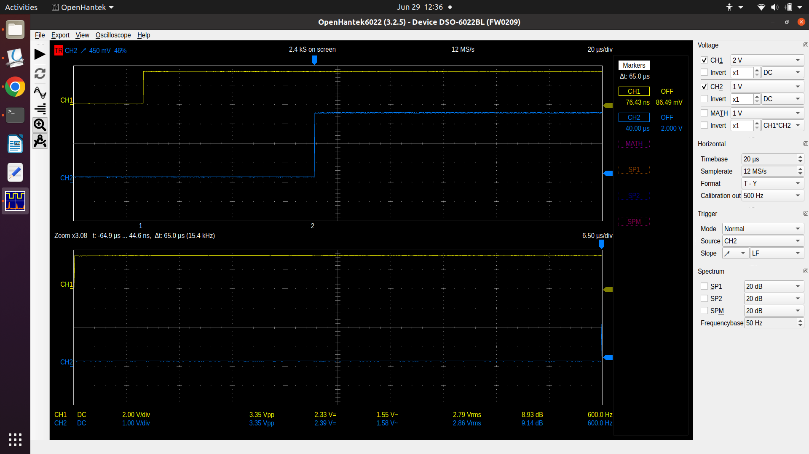

This reading is between timerfd code of grandmaster (Yellow) and slave (Blue) when the ppsctl did not configure the pps-echo pin so the CPU doesn't follows the path of receiving pps signal via interrupt and then generating a new pps output on the echo pin and only using the pps -- echo pin for chrony's use. We can see that It does bring a little improvement for our timing where it was showing 65 us with +- 20us of jitter here it would start showing a gap of 63 us with a much less jitter of +- 10 us.

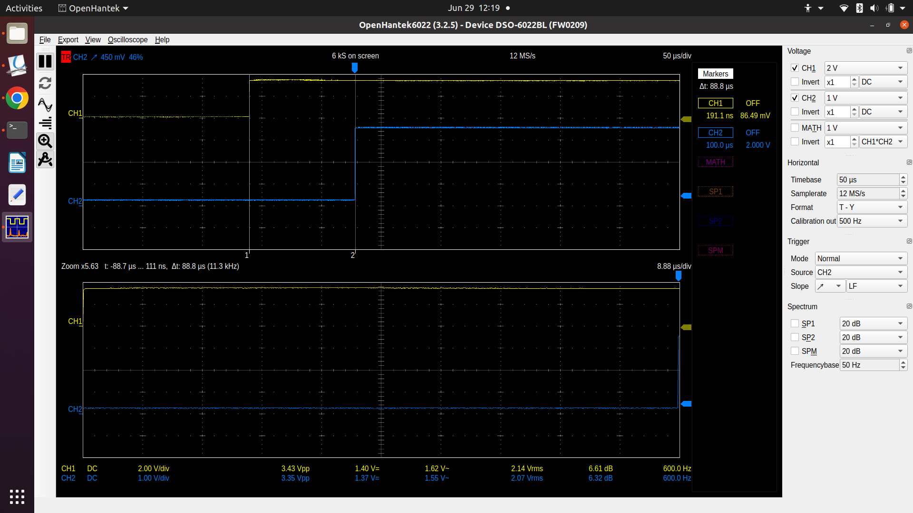

This readings show the difference between the Slave's GPIO pin(Blue) and the pps-echo pin (Yellow) of grandmaster as you can notice here the difference between these two is much higher and jitter of around +-20 us
