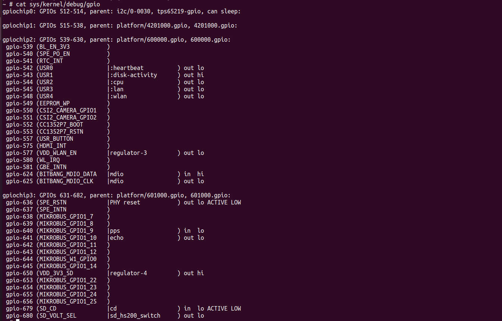
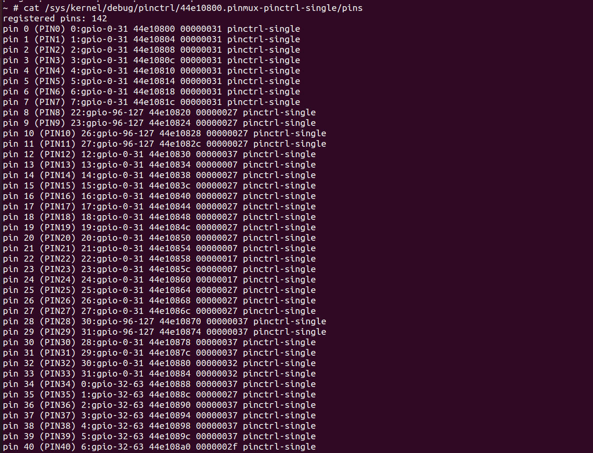
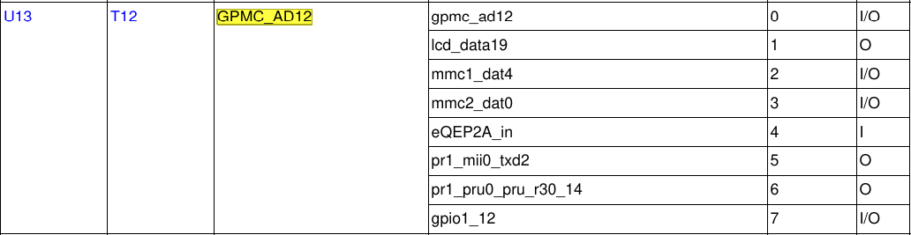
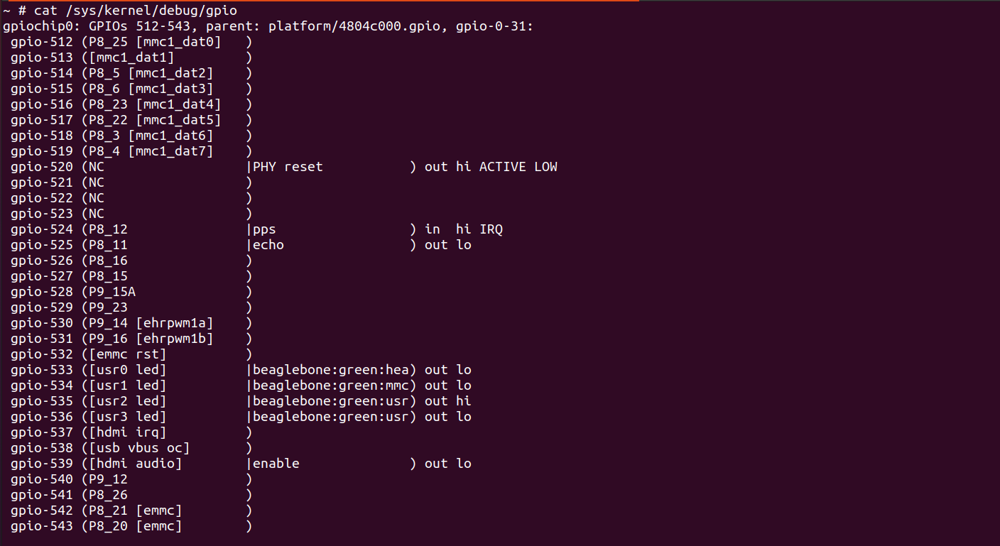

# 1\. Building a cross-compiling toolchain

###### Objective

• Configure the crosstool-ng tool

• Execute crosstool-ng and build up your own cross-compiling toolchain

## 1.1 Getting Crosstool-ng

Let's download the sources of Crosstool-ng, through its git source repository, and switch to a commit that

we have tested:

**$ git clone <https://github.com/crosstool-ng/crosstool-ng>**

**$ cd crosstool-ng/**

**$ git checkout crosstool-ng-1.28.0**

## 1.2 Building and installing Crosstool-ng

As we are not building Crosstool-ng from a release archive but from a git repository, we first need to generate a configure script and more generally all the generated files that are shipped in the source archive for a release:

**$ ./bootstrap**

We can then either install Crosstool-ng globally on the system, or keep it locally in its download direc-

tory. We'll choose the latter solution. As documented at <https://crosstool-ng.github.io/docs/install/>

#### hackers-way, do:

**$ ./configure --enable-local**

**$ make**

Then you can get Crosstool-ng help by running

**$ ./ct-ng help**

## 1.3 Configure the toolchain to produce

A single installation of Crosstool-ng allows to produce as many toolchains as you want, for different archi-

tectures, with different C libraries and different versions of the various components.

Crosstool-ng comes with a set of ready-made configuration files for various typical setups: Crosstool-ng calls them samples. They can be listed by using

**./ct-ng list-samples**.

We will load the aarch64-unknown-linux-uclibc sample. Load it with the ./ct-ng command.

Then, to refine the configuration, let's run the menuconfig interface:

**$ ./ct-ng menuconfig**

In Path and misc options:

• If not set yet, enable Try features marked as EXPERIMENTAL

**In Target options:**

• Set Emit assembly for CPU (ARCH_CPU) to cortex-a53.

• Check that Endianness (ARCH_ENDIAN) is set to Little endian

**In Toolchain options:**

• Set Tuple's vendor string (TARGET_VENDOR) to training.

• Set Tuple's alias (TARGET_ALIAS) to aarch64-linux. This way, we will be able to use the compiler

as aarch64-linux-gcc instead of aarch64-training-linux-musl-gcc, which is much longer to type.

In Operating System:

• Set Version of linux to the closest, but older version to 6.6. It's important that the kernel headers

used in the toolchain are not more recent than the kernel that will run on the board (v6.6).

**In C-library:**

• If not set yet, set C library to musl (LIBC_MUSL)

• Keep the default version that is proposed

**In C compiler:**

• Set Version of gcc to 14.3.0.

• Make sure that C++ (CC_LANG_CXX) is enabled

**In Debug facilities:**

• Remove all options here. Some debugging tools can be provided in the toolchain, but they can also be

built by filesystem building tools.

Finally produce the toolchain by

**$ ./ct-ng build**

The toolchain will be installed by default in x-tools/ directory path. That's something you could have changed in Crosstool-ng's configuration.

# 2 Bootloader - TF-A and U-Boot

As the bootloader is the first piece of software executed by a hardware platform, the installation procedure

of the bootloader is very specific to the hardware platform. There are usually two cases:

• The processor offers nothing to ease the installation of the bootloader, in which case the JTAG has to

be used to initialize flash storage and write the bootloader code to flash. Detailed knowledge of the

hardware is of course required to perform these operations.

• The processor offers a monitor, implemented in ROM, and through which access to the memories is

made easier.

The AM625 SoC on the BeaglePlay falls into the second category. The monitor integrated in the ROM reads

the SD card or any other interface to search for a valid bootloader. If this first interface cannot provide a

valid bootloader, the ROM can search somewhere else or will operate in a fallback mode, that will allow to

use an external tool to reflash some executable through USB. On BeaglePlay board these two options can be chosen with the USR key, available on the side of the board.

###### Objective

- Creating the image files required to boot the r5 processor (for powerup) and the a53.
- Create the TFA image required for the booting.
- Setting Up a tftp connection b/w host and the target to load the bootloader.

First set up the connection of board and host by connecting a ttyl to the boards grnd rx and tx pin for serial connection to the host.

You can use the picocom or microcom with baudrate of 115200.

## 2.1 Understanding AM62x boot process

The AM62x SoC Boot Process is quite complex, involving both numerous hardware and software components. Let's describe the SoC architecture a little bit more.

The AM62x SoC is organized around 3 hardware domains.

First, we have the MAIN domain, which contains the majority of peripherals and where the 4 Cortex-A53

processors are located. These processors will be used to run our Linux kernel and our future userspace

applications.

Next, we have the MCU domain. The main advantage of this domain is the fact that it is isolated from the

rest of the SoC. This domain is controlled by a Cortex-M4F processor.

Finally, we have the WKUP domain which, as its name suggests, is used during deep sleep mode and is

controlled by a Cortex-R5F processor.

**Note: The Cortex-R5F and the Cortex-M4F are 32 bit processors (as opposed to the 64-bit Cortex-A53 processors) and will therefore need a 32-bit cross-compilation toolchain.**

**The purpose of AM62x boot process is to initialize all the peripherals and the processors on this processor in different steps as described below.**

The datasheet describes a software component called TIFS, which stands for TI Foundational Security and

is responsible for the Secure Boot and Power/Ressource Management requests made by the CPUs inside the SoC.

As the master of the boot process, the TIFS, which is running on the M4F processor, will first initiate the

R5 Processor and requests the R5 to load an additional firmware to the TIFS core. Once this is done the R5 will run a U-Boot SPL in order to configure DDR and the R5 firmware. Finally it will request the TIFS to

start the first A53 CPU.

Once the A53 is started, it will load TF-A within the secure world. After this, the A53 will switch to normal

world and load U-Boot SPL which will then load the complete U-Boot image.

The Following Process Flow can be viewed at the following address:

**<https://u-boot.readthedocs.io/en/latest/board/ti/am62x_sk.html>**

## 2.2 Get and install the 32 bit toolchain

Let's download and untar it:

**$ wget <https://developer.arm.com/-/media/Files/downloads/gnu/12.2.rel1/binrel/arm-gnu-toolchain-12.2.rel1-x86_64-arm-none-eabi.tar.xz>**

**$ tar vxf arm-gnu-toolchain-12.2.rel1-x86_64-arm-none-eabi.tar.xz -C \$HOME/x-tools**

Don't forget to add \$HOME/x-tools/arm-gnu-toolchain-12.2.rel1-x86_64-arm-none-eabi/bin/ to your

PATH environment variable. Now our 32 bit toolchain is installed into \$HOME/x-tools directory!

## 2.3 Configure U-Boot for R5 Processor

Because the BeaglePlay board is not yet supported by the mainline U-Boot source, we will use the forked

repository of the BeagleBoard vendor.

**$ git clone <https://git.beagleboard.org/beagleplay/u-boot.git>**

**$ cd u-boot/**

**$ git checkout f036fb**

As we're going to build multiple configurations of U-Boot, we will use out-of-tree build, so that the build is

done in a separate directory from the source tree. This is achieved using the O= variable. So let's create a

build directory for this first U-Boot build:

**$ mkdir -p ../build_uboot/r5**

Run **$ ls configs | grep am62x** to see all predefined configurations.

The one that supports our board for the R5 processor is **am62x_evm_r5_defconfig**, so, run:

**$ make am62x_evm_r5_defconfig O=../build_uboot/r5/**

to load the initial configuration.

Then run

**$ make O=../build_uboot/r5**

Which will build the uboot

If you go into ../build_uboot/r5/ you can see all the files generated during the build process. Keep in

mind that we will only use the SPL image of U-Boot for the R5 booting sequence, which is located in the

spl/ directory.

## 2.4 Get the TI firmware and create tiboot3.bin image

Now we have the SPL for the R5 processor, the R5 processor is also responsible for loading the TIFS

complementary firmware. So let's get it,

**$ cd $HOME/embedded-linux-beagleplay-labs/bootloader**

**$ git clone <https://git.ti.com/git/processor-firmware/ti-linux-firmware.git>**

**$ cd ti-linux-firmware**

**$ git checkout 09.01.00.008**

Next, the AM62x requires both SPL and the TIFS firmware to be grouped into a single image within a X.509

Certificate encapulsation.

To do so, TI provides us a tool called k3-image-gen, so let's use it!

Get k3-image-gen,

**$ cd ..**

**$ git clone <https://git.ti.com/git/k3-image-gen/k3-image-gen>**

**$ cd k3-image-gen/**

**$ git checkout 09.00.00.001**

A few parameters have to be passed to the Makefile,

• The SoC name: SOC=am62x

• The path to the u-boot-spl image: SBL=../build_uboot/r5/spl/u-boot-spl.bin

• The path to the to TIFS firmware binary image: SYSFW_PATH=../ti-linux-firmware/ti-sysfw/ti-

fs-firmware-am62x-gp.bin

In a single command we then have:

**$ make SOC=am62x SBL=../build_uboot/r5/spl/u-boot-spl.bin SYSFW_PATH=../ti-linux-firmware/\\**

**ti-sysfw/ti-fs-firmware-am62x-gp.bin**

The important file produced is tiboot3-am62x-gp-evm.bin, which will have to be named tiboot3.bin, which

is why there is a symbolic link with this name.

## 2.5 Get and compile TF-A

Get the mainline TF-A sources:

**$ cd ..**

**$ git clone <https://github.com/ARM-software/arm-trusted-firmware.git>**

**$ cd arm-trusted-firmware/**

**$ git checkout v2.9**

Several configuration parameters have to be passed to the Makefile:

• Change the cross-compiler prefix for the aarch64 cross-compiler, either using the environment variable:

**$ export CROSS_COMPILE=aarch64-linux-** , or just by adding it to the make command line.

• The architecture has to be selected (aarch64), again just by adding it to the make command line:

ARCH=aarch64

• The AM62x SoC platform which is the k3 family is selected too with PLAT=k3

• And we specify the target board we use with TARGET_BOARD=lite

So the resulting make command is:

**$ make ARCH=aarch64 PLAT=k3 TARGET_BOARD=lite**

The important result of this build is the file build/k3/lite/release/bl31.bin which contains the BL31

stage of the boot process.

## 2.6 Configure U-boot for the A53 Processor

 First of all, like for the R5, we have to create a build directory

 **$ cd $HOME/embedded-linux-beagleplay-labs/bootloader**

 **$ mkdir build_uboot/a53/**

 **$ cd u-boot/**

 For setting-up the A53 U-Boot, we will reuse the previous U-Boot directory. Few configuration changes are however needed

 1\. Change your shell environment variables to match the new target architecture

 **$ export CROSS_COMPILE=aarch64-linux-**

 2\. Load the defconfig corresponding to the am62x for A53 Processor and point to the A53 output directory we just created

 **$ make O=../build_uboot/a53/ am62x_evm_a53_defconfig**

3\. Now we have to adjust the U-Boot configuration, so enter menuconfig:

**$ make O=../build_uboot/a53/ menuconfig**

Once in menuconfig, adjust in the Environment submenu, we will configure U-Boot so that it stores its

environment inside a file called uboot.env in an ext4 filesystem.

• Enable Environment is in a EXT4 filesystem. Disable all other options for environment storage

(e.g. MMC, SPI, UBI)

• Name of the block device for the environment: mmc

• Device and partition for where to store the environment in EXT4: 1:2

• Name of the EXT4 file to use for the environment: /uboot.env

• Disable SPL Environment is in a EXT4 filesystem

4\. Finally, we just have to call the make command and pass some parameters to the makefile:

• The absolute path to the Trusted Firmware (TF-A):

**ATF=\$(realpath ../arm-trusted-firmware/build/k3/lite/release/bl31.bin)**

• The absolute path to the Device Management Firmware (DM) which is included by the ti-linux-

firmware package we downloaded before:

**DM=\$(realpath ../ti-linux-firmware/ti-dm/am62xx/ipc_echo_testb_mcu1_0_release_strip.xer5f)**

• As usual, do not forget to specify the output directory: O=../build_uboot/a53

**$ make ATF=\$(realpath ../arm-trusted-firmware/build/k3/lite/release/bl31.bin) \\**

**DM=\$(realpath ../ti-linux-firmware/ti-dm/am62xx/ipc*echo_testb_mcu1_0_release*\\**

**strip.xer5f) \\**

**O=../build_uboot/a53**

If you go to \$HOME/embedded-linux-beagleplay-labs/bootloader/build_uboot/a53/ , the important files

that have been generated and will be useful in the next steps are tispl.bin and u-boot.img.

If you go to \$HOME/embedded-linux-beagleplay-labs/bootloader/build_uboot/a53/ , the important files

that have been generated and will be useful in the next steps are tispl.bin and u-boot.img.

## 2.7 Preparing a bootable micro-SD card

 The TI ROM code will look for the needed images in a FAT 32 partition on the SD card. To be recognized by the romcode, this partition have to have a special type and a special Bootable Flag

 Let's prepare an SD card with such a partition

 Plug in a sd card to the workstation and do

 **$ lsblk -f**

 This gives you the all the block devices and loops connected on the device . Identify you device select it . in my case the device is named /dev/sda . Do

 **$ sudo umount /dev/sda**

 This unmounts our device from the computer's media and is free to be operated upon by other processes so do

 **$ sudo dd if=/dev/zero of=/dev/sda bs=1M count=16**

 This erases the first 16 blocks of our device making it clean for our use, so now lets start by creating the partitions on the device

 First we need a FAT 32 partition with bootable flag enabled in order to do this do along with a second ext4 partition in order to store our kernel , device tree binary and our uboot.env variables

 **$ sudo cfdisk /dev/sda** and select dos partition this will open the menu for our dos partition . in cfdisk delete all previous partitions and create 2 new partitions

**First partition**

 Size 128 MB

 Bootable flag enabled

 Type: W95 FAT32 (LBA) (c choice)

 Primary partition

 **Second partition**

 Size 300 MB

 Select primary partition

 Type: Linux (83 choice)

 And then finally press write

 To make sure that partition definitions are reloaded on your workstation, remove the SD card and insert it again. Now create a FAT32 filesystem on the bootable partiton

 **$ sudo mkfs.vfat -F 32 -n boot /dev/mmcblk0p1**

 And an EXT4 filesystem on the second partition. Note that we used the -O ^metadata_csum option which allows us to create the filesystem without enabling metadata check-sums, which U-Boot doesn't seem to support yet

 **$ sudo mkfs.ext4 -L env -O ^metadata_csum /dev/mmcblk0p2**

 You can now make your workstation automatically mount this partition by removing the SD card and plugging it back. It should now be mounted on /media/\$USER/boot

 Now, copy the tiboot3.bin image into the SD card, tiboot3.bin is located in the \$HOME/embedded-linux-

 beagleplay-labs/bootloader/k3-image-gen folder and contains the 32 bit binaries

 Next, copy both the tispl.bin and u-boot.img files. This time, the images contains 64 bit binaries, and there-

 fore are contained in the \$HOME/embedded-linux-beagleplay-labs/bootloader/build_uboot/a53 folder

 So we have the following commands

 **$ cp $HOME/embedded-linux-beagleplay-labs/bootloader/k3-image-gen/tiboot3.bin /media/$USER/boot/**

 **$ cp $HOME/embedded-linux-beagleplay-labs/bootloader/build_uboot/a53/tispl.bin /media/$USER/boot**

 **$ cp $HOME/embedded-linux-beagleplay-labs/bootloader/build_uboot/a53/u-boot.img /media/$USER/boot/**

## 2.8 Testing U-Boot

Insert the SD card in the board slot. To boot the board on the external micro-SD card, you need to hold

the USR button at the right of the microSD slot (as seen from above), and then power-up the board through

its USB-C connection, or reset it. You can then release the USR button.

Here's what you should get on the serial line:

U-Boot SPL 2021.01-gf036fbdc25 (Mar 10 2024 - 21:15:12 +0100)

SYSFW ABI: 3.1 (firmware rev 0x0009 '9.1.8--v09.01.08 (Kool Koala)')

SPL initial stack usage: 13384 bytes

Trying to boot from MMC2

spl_load_fit_image: Skip load 'tee': image size is 0!

Loading Environment from MMC... \*\*\* Warning - No MMC card found, using default environment

Starting ATF on ARM64 core...

NOTICE: BL31: v2.9(release):v2.9.0

NOTICE: BL31: Built : 21:31:19, Mar 10 2024

U-Boot SPL 2021.01-gf036fbdc25 (Mar 10 2024 - 22:11:25 +0100)

SYSFW ABI: 3.1 (firmware rev 0x0009 '9.1.8--v09.01.08 (Kool Koala)')

Trying to boot from MMC2

U-Boot 2021.01-gf036fbdc25 (Mar 10 2024 - 22:11:25 +0100)

SoC: AM62X SR1.0 GP

Model: BeagleBoard.org BeaglePlay

Board: BEAGLEPLAY-A0- rev 02

DRAM: 2 GiB

MMC: mmc@fa10000: 0, mmc@fa00000: 1, mmc@fa20000: 2

Loading Environment from EXT4... \*\* File not found /uboot.env \*\*

\*\* Unable to read "/uboot.env" from mmc1:2 \*\*

In:

serial@2800000

Out: serial@2800000

Err: serial@2800000

Error: Can't set serial# to SSSS

Net: Could not get PHY for ethernet@8000000port@1: addr 0

am65_cpsw_nuss_port ethernet@8000000port@1: phy_connect() failed

No ethernet found.

Press SPACE to abort autoboot in 2 seconds

The code above shows us the main steps of the boot process. First we can see that the SPL bootloader as

been loaded by the R5. Next the TF-A (ATF) is loaded and we jump into the normal boot world. Finally,

the 64 bit U-Boot SPL is loaded, which in turns loads U-Boot itself.

Note: We can see that the R5 U-Boot SPL skips the 'tee' image. This is because we chose to not use

OPTEE in order to make the lab easier to understand. If you want to add OPTEE please refer to the

U-Boot Documentation (<https://u-boot.readthedocs.io/en/latest/board/ti/am62x_sk.html>).

Make sure that the version and compile date are right. Otherwise, try again, because this means that you

booted on the internal eMMC , and now type help and press enter.

## 2.9 Adding a new command

 Type config this prints all the available settings uboot was compiled from if not available recompile the uboot environment to include these command type

## 2.10 Setting up networking

The next step is to configure U-boot and your workstation to let your board download files, such as the

kernel image and Device Tree Binary (DTB), using the TFTP protocol through a network connection.

With a network cable, connect the Ethernet port of your board to the one of your computer. If your computer

already has a wired connection to the network, your instructor will provide you with a USB Ethernet adapter.

A new network interface should appear on your Linux system.

### 2.10.1 Network configuration on the target

Let's configure networking in U-Boot:

• ipaddr: IP address of the board

• serverip: IP address of the PC host

**=> setenv ipaddr 192.168.0.100**

**=> setenv serverip 192.168.0.1**

Of course, make sure that this address belongs to a separate network segment from the one of the main

company network.

To make these settings permanent, save the environment:

**=> saveenv**

### 2.10.2 Network configuration on the PC host

To configure your network interface on the workstation side, we need to know the name of the network

interface connected to your board.Find the name of this interface by typing:

**=> ip a**

The network interface name is likely to be enxxx7. If you have a pluggable Ethernet device, it's easy to

identify as it's the one that shows up after pluging in the device. Then, instead of configuring the host IP address from NetworkManager's graphical interface, let's do it through its command line interface, which is so much easier to use:

**$ nmcli con add type ethernet ifname en... ip4 192.168.0.1/24**

## 2.11 Setting up the TFTP server

Let's install a TFTP server on your development workstation:

sudo apt install tftpd-hpa You can then test the TFTP connection. First, put a small text file in the directory exported through TFTP on your development workstation. Then, from U-Boot, do:

**=> tftp 0x80000000 textfile.txt**

In case the download fails, make sure your host interface is correctly configured and if a firewall is enabled

make sure it does not filter out our requests:

**sudo ufw allow from 192.168.0.100**

Otherwise the tftp command should have downloaded the textfile.txt file from your development work-

station into the board's memory at location 0x800000008 .

You can verify that the download was successful by dumping the contents of the memory:

**=> md 0x80000000**

We will see in the next labs how to use U-Boot to download, flash and boot a kernel.

# 3 Fetching Linux kernel sources

###### Objective

• Get the kernel sources from git, using the official Linux source tree.

• Fetch the sources for the stable Linux releases, by declaring a remote tree and getting stable branches

from it.

## 3.1 Setup

Create the \$HOME/embedded-linux-beagleplay-labs/kernel directory and go into it.

Since the Linux kernel git repository is huge, our goal here is to start downloading it right now, before starting is cloning the mainline Linux tree.To begin working with the Linux kernel sources, we need to clone its reference git tree, the one managed by Linus Torvalds.

you can do it directly by connecting to <https://git.kernel.org>:

**$ git clone <https://git.kernel.org/pub/scm/linux/kernel/git/torvalds/linux>**

**$ cd linux**

You will just have to extract this archive in the current directory, and then pull the most recent changes over

the network:s

**$ tar xf linux-git.tar.gz**

**$ cd linux**

**$ git checkout master**

## 3.2 Accessing stable releases

The Linux kernel repository from Linus Torvalds contains all the main releases of Linux, but not the stable

versions: they are maintained by a separate team, and hosted in a separate repository. We will add this separate repository as another remote to be able to use the stable releases:

**$ git remote add stable <https://git.kernel.org/pub/scm/linux/kernel/git/stable/linux>**

**$ git fetch stable**

To print all the available versions of kernel do

**$ git branch -a**

## 3.3 Selecting a kernel version

We are going to use kernel 6.6.104 along with its preempt rt patch . preempt rt patch are only defined for stable releases and a patch for a particular version has to be used with that particular kernel version only.

In order to select 6.6.104 kernel version we have to make

First, execute the following command to check which version you currently have:

**$ make kernelversion**

You can also open the Makefile and look at the beginning of it to check this information.

Now, let's create a local branch starting from that remote branch:

**$ git checkout stable/linux-6.6.y**

Check the version again using the

**$ make kernelversion** command to make sure you now have a 6.6.x version.

Then do

**$ git checkout v6.6.104**

## 3.4 Installing the preempt_rt patch and mergin it with our kernel

 Inside kernel directory do

 **$ mkdir ~/rt-kernel && cd ~/rt-kernel**

download the matching rt60 patch file to the directory _just above_ your current one so it doesn't clutter your repository files:

**$ wget -P ../ <https://www.kernel.org/pub/linux/kernel/projects/rt/6.6/older/patch-6.6.104-rt60.patch.xz>**

 Now, feed that patch directly into your checked-out git repository. Run this command from the root of your repository

 **$ xz -cd ../patch-6.6.104-rt60.patch.xz | patch -p1**

# 4 Cross-compiling environment setup

###### Objective

- To cross compile the entire kernel and then load it onto the target.
- Finally setting up uboot env inorder to automatically bootup the board and load the kernel.

To cross-compile Linux, you need to have a cross-compiling toolchain. We will use the cross-compiling

toolchain that we previously produced, so we just need to make it available in the PATH:

**$ export PATH=$HOME/x-tools/aarch64-training-linux-musl/bin:$PATH**

Also, don't forget to either:

• Define the value of the ARCH and CROSS_COMPILE variables in your environment (using export)

• Or specify them on the command line at every invocation of make, i.e.: make ARCH=... CROSS_COMPILE=

... &lt;target&gt;

**Important:** The majority of tools use aarch64 to define 64 bits ARM processors. However in specific cases,

the tools may use arm64 to define such architecture. In the case of the kernel Makefile we will use the arm64 one.

It is assumed that the ARCH and CROSS_COMPILE variables have been exported.

## 4.1 Linux kernel configuration

By running make help, look for the proper Makefile target to configure the kernel for your processor.

If you search for a configuration file that corresponds to the arm64 architecture that the kernel will use, you

might see that only one defconfig file is available. We will therefore load this basic configuration file and

modify it later.

So, apply this configuration by running make &lt;default-configuration&gt;, and then run make menuconfig to

fine-tune it.

- Enable CONFIG_PREEMPT_RT in the general setup in the preemption type options.
- Disable CONFIG_GCC_PLUGINS if it is set. This will skip building special gcc plugins, which would require extra dependencies for the build.
- In the Platform Selection menu, remove support for all the SoCs except for the Texas Instruments

Inc. K3 multicore SoC architecture.

- Disable CONFIG_DRM, which will skip support for many display controller and GPU drivers.

Please note that this will definitely not build the smallest and most optimized kernel for your board: the

- ARM64 defconfig enables plenty of features and drivers that will not be useful on our particular board.
- Enable pps-gpio device driver inside the device driver category also check that for your board the ptp clock is enabled for TI based processor this is usually done inside the ethernet device driver inside the Network device driver support except for TI most board should turn there own PTP clock via the PTP clock option inside the device driver.

## 4.2 Cross compiling

You're now ready to cross-compile your kernel. Simply run:

**$ make**

and wait a while for the kernel to compile. Don't forget to use make -j&lt;n&gt; if you have multiple cores on your

machine!

Look at the kernel build output to see which file contains the kernel image.

Also look in the Device Tree Source directory to see which .dtb files got compiled. Find which .dtb file

corresponds to your board.

## 4.3 Load and boot the kernel using U-Boot

As we are going to boot the Linux kernel from U-Boot, we need to set the bootargs environment corresponding

to the Linux kernel command line:

**=> setenv bootargs console=ttyS2,115200n8**

**=> saveenv**

We will use TFTP to load the kernel image on the board:

• On your workstation, copy the Image.gz and DTB (k3-am625-beagleplay.dtb) to the directory exposed

by the TFTP server.

• On the target (in the U-Boot prompt), load Image.gz from TFTP into RAM:

**=> tftp 0x80000000 Image.gz**

• Now, also load the DTB file into RAM:

**=> tftp 0x82000000 k3-am625-beagleplay.dtb**

• Boot the kernel with its device tree:

**=> booti 0x80000000 - 0x82000000**

This last command should show you an error message of this type:

kernel_comp_addr_r or kernel_comp_size is not provided!

This is because the boot image that we use, Image.gz, is compressed, and therefore, needs to be uncompressed by U-Boot before continue booting. To do so U-Boot needs to know the maximum size of the uncompressed image and where to store it.

If you look at the size of the uncompressed kernel (Image file), you can estimate that 32 MB (0x2000000) is a reasonable upper bound for the size of the uncompressed kernel, even with a more exhaustive configuration. This gives us,

**=> setenv kernel_comp_addr_r 0x85000000**

**=> setenv kernel_comp_size 0x2000000**

**=> saveenv**

Now you can retry the booti command and see the kernel be uncompressed and then loaded.

You should see Linux boot and finally panicking. This is expected: we haven't provided a working root

filesystem for our device yet.

You can now automate all this every time the board is booted or reset. Reset the board, and customize

bootcmd:

**=> setenv bootcmd 'tftp 0x80000000 Image.gz; tftp 0x82000000 k3-am625-beagleplay.dtb; booti**

**0x80000000 - 0x82000000'**

**=> saveenv**

Restart the board to make sure that booting the kernel is now automated.

# 5 Tiny embedded systems with busybox

###### objective

• be able to configure and build a Linux kernel that boots on a directory on your workstation, shared

through the network by NFS.

• be able to install BusyBox on this filesystem.

• be able to create a simple startup script based on /sbin/init.

## 5.1 Lab implementation

While (s)he develops a root filesystem for a device, a developer needs to make frequent changes to the

filesystem contents, like modifying scripts or adding newly compiled programs.

It isn't practical at all to reflash the root filesystem on the target every time a change is made. Fortunately,

it is possible to set up networking between the development workstation and the target. Then, workstation

files can be accessed by the target through the network, using NFS.

Unless you test a boot sequence, you no longer need to reboot the target to test the impact of script or

application updates.

## 5.2 Setup

In the kernel configuration built in the previous lab, verify that you have all options needed for booting the system using a root filesystem mounted over NFS. Also check that CONFIG_DEVTMPFS_MOUNT is enabled (we will explain it later in this lab). If necessary, rebuild your kernel.

## 5.3 Setting up the NFS server

Create a nfsroot directory in the current lab directory. This nfsroot directory will be used to store the

contents of our new root filesystem. Install the NFS server by installing the nfs-kernel-server package if you don't have it yet. Once installed, edit the /etc/exports file as root to add the following line, assuming that the IP address of your board will be 192.168.0.100:

**/home/&lt;user&gt;/embedded-linux-beagleplay-labs/tinysystem/nfsroot 192.168.0.100(rw,no_root_squash ,no_subtree_check)**

Of course, replace &lt;user&gt; by your actual user name.Make sure that the path and the options are on the same line. Also make sure that there is no space between the IP address and the NFS options, otherwise default options will be used for this IP address, causing your root filesystem to be read-only.

Then, make the NFS server use the new configuration:

**$ sudo exportfs -r**

## 5.4 Booting the system

First, boot the board to the U-Boot prompt. Before booting the kernel, we need to tell it that the root

filesystem should be mounted over NFS, by setting some kernel parameters. So add settings to the bootargs environment variable, in just 1 line:

**=> setenv bootargs ${bootargs} root=/dev/nfs ip=192.168.0.100:::::eth0 nfsroot=192.168.0.1:/home/&lt;user&gt;/embedded-linux-beagleplay-labs/tinysystem/nfsroot,nfsvers=3,tcp rw**

Once again, replace &lt;user&gt; by your actual user name.

Of course, you need to adapt the IP addresses to your exact network setup. Save the environment variables (with saveenv). Now, boot your system. The kernel should be able to mount the root filesystem over NFS:

VFS: Mounted root (nfs filesystem) on device X:Y.

If the kernel fails to mount the NFS filesystem, look carefully at the error messages in the console. If this

doesn't give any clue, you can also have a look at the NFS server logs in /var/log/syslog.

However, at this stage, the kernel should stop because of the below issue:

\[ 7.476715\] devtmpfs: error mounting -2 \]

This happens because the kernel is trying to mount the devtmpfs filesystem in /dev/ in the root filesystem.

This virtual filesystem contains device files (such as ttyS0) for all the devices known to the kernel, and with

CONFIG_DEVTMPFS_MOUNT, our kernel tries to automatically mount devtmpfs on /dev.

To address this, just create a dev directory under nfsroot and reboot. Now, the kernel should complain for the last time, saying that it can't find an init application:

Kernel panic - not syncing: No working init found. Try passing init= option to

kernel. See Linux Documentation/admin-guide/init.rst for guidance. Obviously, our root filesystem being mostly empty, there isn't such an application yet. In the next paragraph, you will add BusyBox to your root filesystem and finally make it usable.

## 5.5 Root filesystem with BusyBox

Download the sources of the latest BusyBox 1.37.x release:

**$ git clone <https://git.busybox.net/busybox>**

**$ cd busybox/**

**$ git checkout 1_37_stable**

Then, you can use

**$ make menuconfig** to further customize the BusyBox configuration. At least, keep the

setting that builds a static BusyBox. Compiling BusyBox statically in the first place makes it easy to set

up the system, because there are no dependencies on libraries. Later on, we will set up shared libraries and recompile BusyBox.

If you are running on a distribution that uses GCC >= 14.x, you will face an issue when trying to run

make menuconfig, caused by a bug in Busybox, unfixed as of Busybox 1.37.0. You can fix this issue by

applying an additional patch to the Busybox source:

**$ git am \$HOME/embedded-linux-beagleplay-labs/tinysystem/data/\\**

**0001-menuconfig-GCC-failing-saying-ncurses-is-not-found.patch**

Prior to building Busybox, make sure your CROSS_COMPILE environment is set to the correct value, pointing to the toolchain we have previously compiled, and used to build our bootloader and Linux kernel.

Build BusyBox:

**$ make**

Going back to the BusyBox configuration interface, check the installation directory for BusyBox10 . Set it to

the path to your nfsroot directory.

Now run **$ make install** to install BusyBox in this directory.

Try to boot your new system on the board. You should now reach a command line prompt, allowing you to

execute the commands of your choice.

## 5.6 Virtual filesystems

Run the # ps command. You can see that it complains that the /proc directory does not exist. The ps

command and other process-related commands use the proc virtual filesystem to get their information from

the kernel. From the Linux command line in the target, create the proc, sys and etc directories in your root filesystem.

We will then mount the proc virtual filesystem in rcS in next step inside this script in your nfsroot/etc/init.d/ ,by adding a line at the end

**mount -t proc proc /proc**

**mount -t sysfs sysfs /sys**

Now that /proc is available, test again the ps command. Note that you can also now halt your target in a clean way with the halt command, thanks to proc being

mounted11 .

## 5.7 System configuration and startup

The first user space program that gets executed by the kernel is /sbin/init and its configuration file is

/etc/inittab. In the BusyBox sources, read details about /etc/inittab in the examples/inittab file. Then, create a /etc/inittab file and a /etc/init.d/rcS startup script declared in /etc/inittab. In this

startup script, mount the /proc and /sys filesystems.

## 5.8 Starting the shell in a proper terminal

Before the shell prompt, you probably noticed the below warning message:

/bin/sh: can't access tty; job control turned off

This happens because the shell specified in the /etc/inittab file in started by default in /dev/console:

::askfirst:/bin/sh

When nothing is specified before the leading ::, /dev/console is used. However, while this device is fine for

a simple shell, it is not elaborate enough to support things such as job control (\[Ctrl\]\[c\] and \[Ctrl\]\[z\]),

allowing to interrupt and suspend jobs.

So, to get rid of the warning message, we need init to run /bin/sh in a real terminal device:

**ttyS2::askfirst:/bin/sh**

Reboot the system and the message will be gone!

Switching to shared libraries

Take the hello.c program supplied in the lab data directory. Cross-compile it for AARCH64, dynamically-

linked with the libraries12 , and run it on the target. You will first encounter a very misleading not found error, which is not because the hello executable is not found, but because something else was not found while trying to execute this executable. You can find it by running file hello on the host:

_hello: ELF 64-bit LSB executable, ARM aarch64, version 1 (SYSV), dynamically linked, interpreter /lib/ld-musl-aarch64.so.1, not stripped_

So, what's missing is the /lib/ld-musl-aarch64.so.1 executable, which is the dynamic linker required to

execute any program compiled with shared libraries. Using the find command, look for this file in the

toolchain install directory, and copy it to the lib/ directory on the target.

Then, running the executable again and see that the loader executes and finds out which shared libraries are

missing.

In our case with the Musl C library, the dynamic linker also contains the C library, so the program should

execute fine, as no further shared libraries are required. If you still get the same error message, just try again a few seconds later. Such a delay can be needed because the NFS client can take a little time (at most 30-60 seconds) before seeing the changes made on the NFS server.

Now that the small test program works, we are going to recompile BusyBox without the static compilation

option, so that BusyBox takes advantage of the shared libraries that are now present on the target.

Before doing that, measure the size of the busybox executable.

Then, build BusyBox with shared libraries, and install it again on the target filesystem. Make sure that the

system still boots and see how much smaller the busybox executable got.

# 6 Cross Compiling third party software

###### Objective

- In order to setup ptp grandmaster clock we need help of some of the user space application : gpsd, chrony , linuxptp and pps-tools for testing some of the stuff.
- Clone there following repo and crosscompile them for our purpose .
- After this we will isolate only those binaries which are supposed to run on the target board

Get to \$HOME/embedded-linux-beagleplay-labs/ and then do

**$ mkdir thirdparty**

This we will use inorder to create the entire setup to put on the target.

But first download timespps.h and place it directly inside the toolchain sysroot folder as musl doesnt includes this by default.

**./aarch64-training-linux-musl/aarch64-training-linux-musl/sysroot/usr/include/sys/timepps.h**

For aarch64 this is the directory for separate arch still will include sysroot/usr/include/sys directory.

This directory includes all the libraries which are required by the third party softwares we intend to use.

Along with this make 2 more directories inside the thirdparty as staging and target staging will have all the output from our crosscompilation and target is going to be copy of our nfsroot directory we are going to simply copy what we need from the staging as not everything thats build by the crosscompilation is required for us and then drop it inside there respective places.

When we cross compile third party user application these application usually belong inside the usr/bin and usr/sbin folder and not at the bin and sbin of root folder.

## 6.1 GPSD

In the third party directory do

**git clone [https://gitlab.com/gpsd/gpsd.git](https://gitlab.com/gpsd/gpsd.git)**

**PKG_CONFIG_PATH="" PKG_CONFIG_LIBDIR="/home/parag/x-tools/aarch64-training-linux-musl/aarch64-training-linux-musl/sysroot/usr/lib/pkgconfig" PKG_CONFIG_SYSROOT_DIR="/home/parag/x-tools/aarch64-training-linux-musl/aarch64-training-linux-musl/sysroot" CC="aarch64-training-linux-musl-gcc" CXX="aarch64-training-linux-musl-g++" scons sysroot=/home/parag/x-tools/aarch64-training-linux-musl/aarch64-training-linux-musl/sysroot --prefix=/usr**

When we do a normal crosscompilation we get errors because the gpsd library needs g++ or (c++ cross compiler ) along with the gcc cross compiler, along with this we also have to manually make sure that it doesnt go ahead and tries to use the host pkg_config hence we have to manually set the the config_path to be empty and set the config_lib path to the crosscompile pkg_config which set the default path for pkg config and the optional pkgconfig to use respectively

Finally after successfully building scons you should get warning like

scons: done building targets.

WARNING: ncurses not found, not building cgps or gpsmon.

WARNING: gpsplot is missing required runtime module matplotlib

WARNING: xgps and xgpsspeed are missing runtime dependencies

Ensure your PYTHONPATH includes /home/parag/.pyenv/versions/3.8.10/lib/python3.8/site-packages/

We are not really going to use these so no real issue.

And then in order to install this into our staging directory do :

**PKG_CONFIG_PATH="" PKG_CONFIG_LIBDIR="/home/parag/x-tools/aarch64-training-linux-musl/aarch64-training-linux-musl/sysroot/usr/lib/pkgconfig" PKG_CONFIG_SYSROOT_DIR="/home/parag/x-tools/aarch64-training-linux-musl/aarch64-training-linux-musl/sysroot" CC="aarch64-training-linux-musl-gcc" CXX="aarch64-training-linux-musl-g++" scons install DESTDIR=../staging/ --prefix=/usr**

This will install all the applications inside the usr folder it includes man pages and user space application what's of our use is everything it installed inside the usr/bin and usr/sbin directory.

When we do files \* you would see that it is build for aarch64 architecture and not host system hence could be used

Copy everything inside staging/usr/bin and staging/usr/sbin into the target/usr/bin and target/usr/sbin folder

Finally you would also see that it creates a library named [libgps.so](http://libgps.so/).32.0.0 with a symbolic link inorder to copy both the library and its symbolic link do cp -a [libgps.so](http://libgps.so/).32\* ../target/usr/lib/ to make sure both symbolic link and the library itself are copied to its correct place.

## 6.2 Chrony

Chrony includes 2 major libraries chronyc and chronyd chronyd is the actual daemon that does the job of changing clock frequency and chronyc is its interface. In our environment we are going to use this to get the data from the gps and pps signal of that gps inorder to synchronize the internal clock of beagleplay to the satellites clock at highest possible accuracy.\\

So first lets clone chrony

**$ git clone <https://gitlab.com/chrony/chrony.git>**

We are going to be using make file for cross compilation here so do

**$ CC="aarch64-training-linux-musl-gcc" ./configure --prefix=/usr --host-system=Linux --host-machine=aarch64 --disable-readline --without-editline --without-gnutls --disable-sechash --without-nettle --without-nss --without-tomcrypt --disable-nts --disable-ipv6 --without-libcap --disable-forcednsretry --without-aes-gcm-siv**

Then run  
**$ make**

To build our configuration with cross-compiler for aarch64

Finally do

**$ make DESTDIR=/home/parag/embedded-linux-beagleplay-labs/thirdparty/staging/ install**

You might get an error while trying to create the manpages inorder to make sure the installation completes successfully

**$ sudo apt install asciidoctor**

This is the tool used to create the manpages

## 6.3 linuxptp

Linuxptp app includes the phc2sys and the ptp4l binaries that we will require for our grandmaster & slave clock synchronization with the system's internal clock , it also includes ts2phc.

**$ git clone https://github.com/richardcochran/linuxptp.git **

When you do

**$ make CC=aarch64-training-linux-musl-gcc**

You will get an error saying \\

_aarch64-training-linux-musl-gcc -Wall -DVER=4.4-00059-ge4d271d-dirty -c -o ptp4l.o ptp4l.c_

_In file included from clock.h:25,_

_from ptp4l.c:26:_

_config.h:24:10: fatal error: sys/queue.h: No such file or directory_

_24 | #include &lt;sys/queue.h&gt;_

_| ^~~~~~~~~~~~~_

_compilation terminated._

_make: \*\*\* \[&lt;builtin&gt;: ptp4l.o\] Error 1_

This is same as when we were trying to compile gpsd with pps and timepps.h wasnt present in the toolchain so.. Here we will just download a standalone queue.h file from openBSD

<https://github.com/openbsd/src/blob/master/sys/sys/queue.h>

<https://github.com/openbsd/src/blob/master/sys/sys/_null.h>

And then put it inside

**$ sudo cp queue.h \\ /home/parag/x-tools/aarch64-training-linux-musl/aarch64-training-linux-musl/sysroot/usr/include/sys/**
and **$ sudo cp _null.h \\ /home/parag/x-tools/aarch64-training-linux-musl/aarch64-training-linux-musl/sysroot/usr/include/sys/**

And then retry you will get an error as

In file included from clock.c:36:

_missing.h:66:9: error: redeclaration of enumerator 'HWTSTAMP_TX_ONESTEP_P2P'_

_66 | HWTSTAMP_TX_ONESTEP_P2P = 3,_

_| ^~~~~~~~~~~~~~~~~~~~~~~_

_In file included from clock.c:21:_

_/home/parag/x-tools/aarch64-training-linux-musl/aarch64-training-linux-musl/sysroot/usr/include/linux/net_tstamp.h:129:9: note: previous definition of 'HWTSTAMP_TX_ONESTEP_P2P' with type 'enum hwtstamp_tx_types'_

_129 | HWTSTAMP_TX_ONESTEP_P2P,_

_| ^~~~~~~~~~~~~~~~~~~~~~~_

_missing.h:72:9: error: redeclaration of enumerator 'SOF_TIMESTAMPING_BIND_PHC'_

_72 | SOF_TIMESTAMPING_BIND_PHC = (1 << 15),_

_| ^~~~~~~~~~~~~~~~~~~~~~~~~_

_/home/parag/x-tools/aarch64-training-linux-musl/aarch64-training-linux-musl/sysroot/usr/include/linux/net_tstamp.h:33:9: note: previous definition of 'SOF_TIMESTAMPING_BIND_PHC' with type 'enum &lt;anonymous&gt;'_

_33 | SOF_TIMESTAMPING_BIND_PHC = (1 << 15),_

_| ^~~~~~~~~~~~~~~~~~~~~~~~~_

_missing.h:75:8: error: redefinition of 'struct so_timestamping'_

_75 | struct so_timestamping {_

_| ^~~~~~~~~~~~~~~_

_/home/parag/x-tools/aarch64-training-linux-musl/aarch64-training-linux-musl/sysroot/usr/include/linux/net_tstamp.h:58:8: note: originally defined here_

_58 | struct so_timestamping {_

_| ^~~~~~~~~~~~~~~_

_make: \*\*\* \[&lt;builtin&gt;: clock.o\] Error 1_

This is because the script that generates this now has a crosscompilation toolchain but incdefs.sh probes kernel headers to detect which features are already present in your sysroot. Without KBUILD_OUTPUT, it reads the host machine's headers instead of the cross-toolchain's - causing it to miss defines that exist in the target sysroot, which then leads to missing.h trying to redefine them and failing.

Run make clean and then

**$ KBUILD_OUTPUT=/home/parag/x-tools/aarch64-training-linux-musl/aarch64-training-linux-musl/sysroot \\**

**make CC=aarch64-training-linux-musl-gcc -- prefix=/usr**

Then finally do

**$ make DESTDIR=../staging --prefix=/usr install**

## 6.4 pps-tools

This user application contains tools like ppsctl and ppstest which we will require for our final test

<https://github.com/redlab-i/pps-tools> get the source code from here

Then do

**$ make CC=aarch64-training-linux-musl-gcc**

**$ make DESTDIR=../staging --prefix=/usr install**

## 6.5 Creating target

After crosscompilation we need to understand what crosscompiled for host system and what we compiled for our target most of the stuff that we require is going to be inside bin , sbin , lib folder

So one by one go into each folder and repeat this same process

**$ file \***

This will help us check if all the files are correctly crosscompiled

Then you can also strip the libraries by

**$ aarch64-training-linux-musl-strip * **
going inside both bin ,sbin and lib directory of inside target

After this we are going to copy all the files into there respective folders inside the target eg: usr/bin of staging goes inside usr/bin of target

What we want to make sure is put only what is required which would only bein these folder

Gpsd is a special case you will see it creates multiple files inside lib

**parag@XIOS:~/embedded-linux-beagleplay-labs/thirdparty/staging/usr/lib\$ ls**

**libgpsdpacket.so libgpsdpacket.so.32 libgpsdpacket.so.32.0.0 libgps.so libgps.so.32 libgps.so.32.0.0 pkgconfig**

When you do file \*

You will see that only 2 binaries are there and multiple symbolic links to these libraries

**parag@XIOS:~/embedded-linux-beagleplay-labs/thirdparty/staging/usr/lib\$ file \***

**libgpsdpacket.so: symbolic link to libgpsdpacket.so.32.0.0**

**libgpsdpacket.so.32: symbolic link to libgpsdpacket.so.32.0.0**

**libgpsdpacket.so.32.0.0: ELF 64-bit LSB shared object, ARM aarch64, version 1 (SYSV), dynamically linked, stripped**

**libgps.so: symbolic link to libgps.so.32.0.0**

**libgps.so.32: symbolic link to libgps.so.32.0.0**

**libgps.so.32.0.0: ELF 64-bit LSB shared object, ARM aarch64, version 1 (SYSV), dynamically linked, stripped**

**pkgconfig: directory**

So in order to copy these file we require both the symbolic link and the original file for this inorder to get that we are going to copy both by

**$ cp -a** [**libgpsdpacket.so**](http://libgpsdpacket.so/)**.32\* ../target/usr/lib**

**$ cp -a** [**libgps.so**](http://libgps.so/)**.32\* ../target/usr/lib**

This completes our entire third party software requirements inorder to safely copy these onto the nfs root first make sure that file \* of all the new third party software results in this string **ELF 64-bit LSB shared object, ARM aarch64, version 1 (SYSV), dynamically linked, stripped**

As output

After the check simply copy the entire usr folder of target into the nfsroot and boot up the board you will see that you are able to use these application directly.

# 7 Accessing Hardware devices

For the setup i am using Beagleplay as the grandamster and Beagleboneblack as the slave. Communicating with GPS requires a UART for NMEA data and a GPIO pin for PPS signal , along with this we will also require a output pin for echo-gpios which is used by pps-gpio driver to generate a interrupt on receiving a signal from PPS pin.

Inorder to make sure that this happens we have to make some modification in the device tree structure depending upon the current GPIO state.

###### Objective

- Identify the uart to use for GPS , GPIO pins for pps-gpio for both input and output , GPIO pin which we will use for our own pps-pulser.c gpios.
- Modify the device tree structure to use these pins for our functionality.

## 7.1 Beagleplay

### 7.1.1 Default state and requirements

<https://docs.beagleboard.org/latest/boards/beagleplay/03-design.html>

This is the default configuration of beagleplay mikrobus as you can see we already have

- A UART configured by default on the pin RX and TX as UART 5
- 4 GPIO pins GPIO 9 ,10 ,11, 12.

For UART we have to make sure that it is enabled in the device tree structure if not then how to enable it and for GPIO we have to configure the GPIO pins input or output inorder to match our requirements so that we get 1 input pin for PPS signal of GPS and 2 output pins 1 for echo-gpios of pps and 1 for our user space application that is uses ioctl.

pps-gpio or the driver that would feed our chrony services the PPS signal of GPS is a internal kernel module hence we have to configure the device tree it reserves these pins for its own use , echo-gpios or the echo pps pins simply outputs a PPS signal and is also a part of the pps-gpio driver itself.

Unlike kernel drivers that must have their pin mappings written into the Device Tree at boot, user-space tools handle hardware differently.For dedicated hardware interfaces like a UART, the Device Tree must be enabled beforehand. This allows the kernel to initialize the peripheral and create the serial node (such as /dev/ttyS2). The user-space app then simply opens that file node to use the serial link.For generic pins used by pps-pulser.c, the process is different. The Device Tree only needs to make sure the pin is configured as a basic GPIO output line rather than a specialized function.

### 7.1.2 Implementation

you can check information about available GPIOs banks and which GPIOs are already in use:

**~# cat /sys/kernel/debug/gpio**

We are going to see how to enable the UART first go into the k3-am625-beagleplay.dts inside the

**arch/arm64/boot/dts/ti** of our linux directory. Here when we search for uart5 it belongs to

**pinctrl-0 = &lt;&mikrobus_uart_pins_default&gt;; and status="okay"** by default so no changes needed.

Now onto the GPIO pins , when we search for gpios we will eventually get into the main_pmx0 section where

mikrobus_gpio_pins_default: mikrobus-gpio-default-pins {

pinctrl-single,pins = <

AM62X_IOPAD(0x019c, PIN_INPUT, 7) /* (B18) MCASP0_AXR1.GPIO1_9 */

AM62X_IOPAD(0x01a0, PIN_INPUT, 7) /* (E18) MCASP0_AXR0.GPIO1_10 */

AM62X_IOPAD(0x01a8, PIN_INPUT, 7) /* (D20) MCASP0_AFSX.GPIO1_12 */

\>;

};

This is going to be all we need so inside that same directory create a new file named k3-beagleplay-custom.dts. The default device tree structure should be only modified by using a new file and no changes should be made in the file itself it is supported by the device tree structure as the last correct configuration that takes place for a particular device is going to be the actual device configuration.This way we can keep our manual configuration separate from default configuration.

/dts-v1/; **/\* THIS line is required for every device tree structure it means device tree structure version 1\*/**

~#include "k3-am625-beagleplay.dts" **/\* we are going to include our original device tree structure and our new device tree structure is going to be compiled after this \*/**

&main_pmx0 {

mikrobus_gpio_pins_custom: mikrobus-gpio-custom-pins {

pinctrl-single,pins = <

AM62X_IOPAD(0x019c, PIN_INPUT, 7) /\* GPIO1_9 \*/

AM62X_IOPAD(0x01a0, PIN_OUTPUT, 7) /\* GPIO1_10 set to OUTPUT \*/

AM62X_IOPAD(0x01a8, PIN_OUTPUT, 7) /\* GPIO1_12 \*/

\>;

};

}; **/\* create a new structure using the copy of the code from the device tree structure make sure the names are different along with correct configuration instead of default i have used custom pins \*/**

&main_gpio1 {

pinctrl-names = "default";

pinctrl-0 = &lt;&mikrobus_gpio_pins_custom&gt;;

}; **/\* for this check the default dts again you will see that &main_gpio previously pointed at mikrobus_gpio_pins_default we have to change this as otherwise since the configuration is still present in the default structure itself it would pass it we do this by configuring it in the custom part \*/**

/{

pps{

compatible = "pps-gpio";

label = "pps-gpio";

gpios = &lt;&main_gpio1 9 GPIO_ACTIVE_HIGH&gt;;

echo-gpios = &lt;&main_gpio1 10 GPIO_ACTIVE_HIGH&gt;;

echo-active-ms = &lt;100&gt;;

status = "okay";

};

};

**/\* for this part i suggest checking out the pps-gpio.yaml file in the /Documentation/devicetree/bindings/pps/ of our linux directory it gives the exact way as to how to reserve the pins for the pps-gpio devices what are its requirements and whats optional \*/**

After saving this go back to the linux directory start and do

**$ make ARCH=arm64 CROSS_COMPILE=aarch64-training-linux-musl- dtbs**

This should remake the dtb for our dts so reload that dtb onto the board and reset and see if the changes applied using

**~# cat /sys/kernel/debug/gpio**

You should see pps and echo against the MIKROBUS pin 9 and 10.

## 7.2 BeagleBoneBlack

Unlike Beagleplay , Beagleboneblack doesnt have mikrobus and also has far more GPIO pins comparatively. So configuring the pins for beaglebone is going to be much more complex to start with do

**~# cat /sys/kernel/debug/gpio**

This should output all the pins that are available as GPIO we are going to use pins P8_12 and P8_11 of gpiochip0 which are available at gpiochip0 line 12 and 13 respectively.

We have to hunt these 2 pins inside the main_pmux and then onto the datasheet of am335x for this.

To print there addresses use

**~# cat /sys/kernel/debug/pinctrl/44e10800.pinmux-pinctrl-single/pins**

read the pins file located inside Linux's debugfs directory structure (specifically under the pinctrl subsystem).

It dumps the low-level hardware multiplexing state of the processor package, showing exactly how each physical SoC pad/pin is routed (e.g., whether it is assigned to a generic GPIO bank like gpio-0-31 or gpio-96-127, its hexadecimal memory address, and its register mode configuration value).

Right now this wont exactly be useful but this will give us a good idea as to how to read the dt-bindings/pinctrl.h later.

So to start go into the arch/arm/boot/dts/omap and open the am335x-boneblack.dts

Inside this you will see headers for multiple boneblack board you can go through all the files , u will find that main_pmux is inside am335x-bone-common.dtsi but you will find that it doesnt uses our particular pin P8_11 and P8_12 for anything which would also be what cat /sys/kerenel/debug/gpio 's output will tell us.

So in order to use this we are going to go inside the dt-bindings/pinctrl/am33xx.h which is pointed by the am33xx.dtsi include file of our device tree structure. You will not find the dt-bindings/pinctrl/am33xx.h inside the dts instead it is inside the linux directories include/dt-bindings/pinctrl directory

When you open this and move down you will find address offset of many of the pins , this is a 12 bit address offset starting from 0x44E10800 our addresses for line 12 and 13 were 0x44E10830 and 0x44E10834

**#define AM335X_PIN_GPMC_AD12 0x830**

**#define AM335X_PIN_GPMC_AD13 0x834**

Finally we are going to hunt these pins in the datasheet for there pin multiplexing

But now you will notice that this belongs to gpio1 and is pin names now are gpio1_13 and gpio1_12.

This is because older Linux kernels or unoptimized Device Trees, the kernel did not care about matching the datasheet bank numbers. It assigned the software names (gpiochip0, gpiochip1, etc.) dynamically based on which hardware driver finished initializing first during the boot sequence, or the order they appeared sequentially in the compiled Device Tree file. If the hardware bank at 4804c000 finished probing first, Linux handed it the software index 0.

You can check about this here.

<https://forum.beagleboard.org/t/wrong-order-of-gpiochip0-3/33852/4> <https://forum.digikey.com/t/am335x-device-tree-leds-and-sys-kernel-debug-gpio/26487/2> here they also mention in order to solve this problem they made use of alias so that it mapped well between datasheet and kernel i am using what jackthree said on the texasinstrument forms and just not trust the output of sys interface .

So onto making the custom device tree structure.

/dts-v1/;

~#include "am335x-boneblack.dts"

&am33xx_pinmux{

gpio_custom: pinmux_gpio_pins{

pinctrl-single,pins=<

AM33XX_PADCONF(AM335X_PIN_GPMC_AD12,PIN_INPUT_PULLUP,MUX_MODE7) //GPIOP8_12

AM33XX_PADCONF(AM335X_PIN_GPMC_AD13,PIN_OUTPUT_PULLDOWN,MUX_MODE7) //GPIO P8_11

\>;

};

};

&gpio1{

pinctrl-names = "default";

pinctrl-0 = &lt;&gpio_custom&gt;;

};

**/\* here instead of suggested by the output of our sys interface we are going to be using gpio1\*/**

/{

pps{

compatible = "pps-gpio";

label = "pps-gpio";

gpios = &lt;&gpio1 12 GPIO_ACTIVE_HIGH&gt;;

echo-gpios = &lt;&gpio1 13 GPIO_ACTIVE_HIGH&gt;;

echo-active-ms = &lt;100&gt;;

status = "okay";

};

};

Finally save this and move into the linux directory to do

**\$ make ARCH=arm CROSS_COMPILE=arm-linux- dtbs** after this when you run the

**~# cat sys/kernel/debug/gpio**

You should notice the pps and echo pin in the line of P8_11 and P_12 pins.

# 8 Configuring the device's Software

After successfully copying the usr folder from target onto nfsroot wait a few minutes for the changes to actually take place on the board

###### Objective

- Testing the entire data pipeline for gpsd+pps->chrony->phc2sys->ptp4l on grandmaster
- Testing the entire data pipeline for ptp4l->phc2sys for slave.
- Making the connections b/w gpsd and the gps module we will use and configuring and finetuning gpsd,chrony,phc2sys and ptp4l

While testing make sure everything is happening in foreground as we wont be able to see the logs inside our tmpfs filesystem that easily through serial console.

First Check the entire system by using these following commands , also add

**mount -t debugfs debugfs /sys/kernel/debug/**

To the end of your rcS script after making sure CONFIG_GPIO_SYSFS is enabled in kernel configuration if not then enable it and remake the kernel

Linux already has /proc/ and /sys/ to expose system information, but the kernel developers created strict rules for those directories (e.g., a file in /sys/ is only supposed to contain one single value).

Kernel developers needed a "wild west" area where they could dump raw, unstructured debugging data, memory registers, and pin states without breaking those rules. That is what debugfs is.

## 8.1 Setting Up Grandmaster

First thing to do is set up the network

### 8.1.1 Network Setup

**~# ip link set lo up**

**link**: Tells the tool that you want to manage a network interface at the data link layer.

The target interface. lo stands for **loopback**, which is the virtual network interface that the system uses to talk to itself (mapped to the 127.0.0.1 localhost IP address).

**up**: The state you are putting the interface into (turning it on). Its opposite is down.

**~# ip addr add 192.168.0.100/24 dev eth0**

This adds a ip address to the ethernet port eth0 for our usecase we are using ip 192.168.0.100/24

**~# ip link set eth0 up**

**Powers the PHY:** It wakes up the physical transceiver (PHY) chip on the BeaglePlay so it can start detecting network traffic.

After this first we are going to start the chrony services for this we require to setup a conf file for chrony inside the etc folder named chrony.conf each part of this conf file basically decides how the chrony app will adjust the internal frequency of the clock

### 8.1.2 Chrony setup

**refclock SHM 0 refid GPS precision 1e-1 offset 0.000 delay 0.2 trust**

**precision 1e-1:** Defines that we don't expect this specific NMEA data to be high-precision (we rely on the separate PPS signal for that).

**offset 0.000:** Applies a manual calibration offset. A value of 0.000 means we are not adding any manual time adjustments to this source.

**delay 0.2:** Defines the expected latency of the serial connection. A value of 0.2 tells Chrony to assume the NMEA string took 200ms to travel from the GPS to the system, allowing it to mathematically compensate for the lag.

**trust:** Dictates that we can trust this clock to set the initial system time. This option is required because when the BeaglePlay starts up, its internal clock might default to January 1, 1970. The trust flag allows Chrony to use this GPS data to bridge that massive initial time gap.

**refclock PPS /dev/pps1 refid PPS lock GPS precision 1e-9 prefer**

This sets the clock to follow the /dev/pps1 signal on our device which is connected to the gps's pps signal we are going to use this as pulse per second for our chrony device at highest possible precision of 1e-9, and by setting prefer we have basically configured it so that it always takes time from here

**#rtcsync**

Use this incase you use the internal rtc sync tho i havent used it so i dont really know how to use it so you might have to research a bit on your own , it is basically supposed to make the chrony follow rtc clock incase the gps is not locked or got disconnected.

**makestep 1.0 3**

Incase the difference b/w system clock and the clock from gps is bigger then 1 sec for 3 times in a row make the clock step to be able to get very close to the clock as possible

**allow all**

**logdir /var/log/chrony**

**log tracking measurements statistics**

For logging purpose.

After this do

**~# /usr/sbin/chronyd -f /etc/chrony.conf**

This should start chrony services without gpsd so when you run **chronyc sources** you should see gps and pps are not locked.

### 8.1.3 gpsd setup

**~# gpsd -b -F /var/run/gpsd.sock -n /dev/ttyS0 -N -D 5**

**Or (gpsd -b -F /var/run/gpsd.sock -n /dev/ttyS0 & when its working correctly)**

This should start the gpsd services when gps rx and tx pins are connected to uart 5 of beagleplay board

<https://docs.beagleboard.org/_images/mikroBUS1.svg>

~ # dmesg | grep -i "serial"

\[ 0.027989\] Serial: AMBA PL011 UART driver

\[ 0.119774\] Serial: 8250/16550 driver, 4 ports, IRQ sharing enabled

\[ 0.297972\] 2800000.serial: ttyS2 at MMIO 0x2800000 (irq = 289, base_baud = 3000000) is a 8250

**\[ 0.300403\] 2850000.serial: ttyS0 at MMIO 0x2850000 (irq = 290, base_baud = 3000000) is a 8250**

\[ 0.302637\] 2860000.serial: ttyS1 at MMIO 0x2860000 (irq = 291, base_baud = 3000000) is a 8250

When you check the internals of this by going into the device tree you should find that 0x2850000 is for uart5 on the board

gpsd can select the baudrate of the device on its own it checks the NMEA string passed by the gps against predefined set of baudrate and uses the one that matches so connecting a device to use the gps should'nt be a problem after some initial warnings you should see the NMEA string printing out the NMEA from the GPS. -F /var/run/gpsd.sock creates a pseudo sock for the ipv4 socket it was throwing some errors without it so make sure it does that.

After starting the gpsd successfully wait a few minutes before rechecking the chrony services it should now start locking the pps and gps signals , the way chrony works is first it would make the gps signal follow correctly before moving onto the pps signal.

**~# ppsctl -ea /dev/pps1**

This will now setup and start the echo pps pin which we will later use for testing

Once the chrony services have started tracking the gps correctly you can make sure it does so by running

**~# chronyc tracking**

Check the clock offset it should be very low

After we confirm the chronyc tracking we are going to pass this onto the NIC of our board for which we require a bridge that passes this on which happens to be phc2sys

### 8.1.4 phc2sys setup

**~# phc2sys -s CLOCK_REALTIME -c /dev/ptp0 -O 0 -S 0.0001 -P 0.4 -I 0.1 -R 10 -m**

(**phc2sys -s CLOCK_REALTIME -c /dev/ptp0 -O 0 -S 0.0001 -P 0.4 -I 0.1 -R 10 & after testing and making sure its working correctly**)

This starts the servo between internal clock and the phy clock of NIC to make it stable the step size is set to -S 0.0001 or 10 microseconds if the offset is higher then this it would make the clock step , P and I option sets the Kp and Ki constant of the servo and R decides the rate per second or it is going to compare the system clock and PHY clock 10 times per second, on grandmaster clock side the we have set the -s to CLOCK_REALTIME and -c to /dev/ptp0 which means the CLOCK_REALTIME is acting as the master and the /dev/ptp0 device is acting as the slave. This should start logging master offset to very low after a few seconds.

### 8.1.5 ptp4l setup

**~# ptp4l -E -4 -H -p /dev/ptp0 --priority1 127 -i eth0 -m**

**\-E**: Enables the **End-to-End (E2E)** delay mechanism. This tells ptp4l to calculate network propagation delay by measuring the round-trip time of sync messages directly between the master and slave devices.

**\-4**: Forces the use of **IPv4** (UDP/IP) as the transport layer for the PTP messages.

**\-H**: Forces **Hardware Timestamping**. This is the critical flag for a Grandmaster. It tells ptp4l to bypass the Linux OS kernel's software clock and use the physical timestamping engine inside the BeaglePlay's network interface chip (PHY).

**\-p /dev/ptp0**: Explicitly selects the Hardware Clock device. /dev/ptp0 is the primary physical clock on your board.

**\--priority1 127**: Overrides the default PTP priority 1 value (which is 128). In the PTP Best Master Clock Algorithm (BMCA), **lower numbers win**. By dropping this to 127, you are telling other devices on the network: _"I have a highly accurate clock source (GPS/PPS), prefer me as the Grandmaster."_

**\-i eth0**: Binds the daemon to the **eth0** network interface that you just brought up in the previous step.

**\-m**: Stands for "print messages". It forces ptp4l to print its log outputs directly to standard output (stdout) on your terminal screen instead of hiding them in the system log background.

**NOTE: you can check what exact output to be expected in the other document for Theory and Results**

## 8.2 Setting Up slave

Setting up the slave device works in the exact opposite way of setting up the grandmaster it takes the time from the NIC ports and synchronizes the CLOCK_REALTIME using it

### 8.2.1 Network Initialization

**~# ip addr add 192.168.0.102/24 dev eth0**

This command assigns a static IP address and defines the network boundaries for your network card.

- **192.168.0.102:** The exact IPv4 address being assigned to this slave machine.
- **/24:** The subnet mask in CIDR (Classless Inter-Domain Routing) notation. This is equivalent to 255.255.255.0. It tells the networking stack that the first three octets (192.168.0) define the local network, meaning the slave knows it can communicate directly with any other IP from .1 to .254 on that subnet without routing traffic through a gateway.
- **dev eth0:** Specifies the exact hardware device receiving this configuration. eth0 is the traditional Linux naming convention for the first physical Ethernet port.

**\$ ip link set eth0 up**

Even if a network card has an IP address, it cannot transmit or receive data until the operating system physically activates the port.

- ip link: The subcommand used to manage the physical and link layer (Layer 2) state of network interfaces.
- eth0: The target network interface.
- up: The state command that brings the interface online. It signals the network interface controller (NIC) to power up the port, establish a link with the connected switch or Grandmaster, and begin processing incoming and outgoing packets.

Without these commands, the eth0 interface remains in an ADMIN_DOWN state. If the interface is down, PTP daemons like ptp4l or chrony will crash or throw errors because they cannot bind to the required UDP ports (typically port 319 and 320 for PTP). Once the link is up and addressed, the slave's NIC is officially ready to start capturing hardware timestamps from your Grandmaster's data stream.

### 8.2.2 ptp4l setup

**~# ptp4l -E -4 -H -s -i eth0 -m**

**ptp4l**: The main executable from the linuxptp package. It implements the IEEE 1588 Precision Time Protocol on Linux.

**\-E (End-to-End)**: Tells the daemon to use the **E2E delay mechanism**. It calculates the network delay by sending a Delay_Req (Delay Request) message to the Grandmaster and waiting for a Delay_Resp (Delay Response) message. It measures the total time across the entire path.

**\-4 (IPv4 Transport)**: Forces the daemon to use **UDP over IPv4**. By default, PTP can run directly over Layer 2 Ethernet (which has no IP addresses), but -4 tells it to route the PTP packets using standard IP networking (which relies on that 192.168.0.102 address you just configured).

**\-H (Hardware Timestamping)**: This is the magic flag for nanosecond precision. Instead of letting the operating system software guess when a packet arrived, -H tells the physical Network Interface Card (NIC) to stamp the exact nanosecond the PTP packet hits the physical copper/fiber port.

**\-s (Slave-Only Mode)**: Forces this machine to act **only** as a slave (or timeReceiver). PTP networks usually run the BMCA (Best Master Clock Algorithm) where nodes negotiate who has the best clock to become the master. This flag forcefully removes the node from the election, ensuring it never accidentally tries to act as the Grandmaster.

**\-i eth0 (Interface)**: Binds the PTP daemon to listen and transmit specifically on the eth0 network interface.

**\-m (Print Messages)**: Directs the daemon to output its logs directly to standard output (the terminal screen) instead of hiding them in the background system logs (syslog). This is highly useful for live monitoring and debugging.

When you run this, you will immediately start seeing a live stream of text on your console. You will see it initialize, spot the Grandmaster on the network, run the Best Master Clock Algorithm (which it will concede due to the -s flag), and finally output a continuous feed of your **clock offset** and **frequency adjustment** values as it actively syncs your slave's hardware clock to the Grandmaster.

### 8.2.3 phc2sys setup

**~# phc2sys -s /dev/ptp0 -c CLOCK_REALTIME -L 500000 -P 0.2 -I 0.1 -R 4 -w -m -S 0.001 -F 0.00002**

**\-s /dev/ptp0 (Source):** Defines the source clock. It tells the daemon to read the time from /dev/ptp0, which is the physical hardware clock (PHC) on your NIC that ptp4l just synchronized.

**\-c CLOCK_REALTIME (Destination):** Defines the target clock. This tells the daemon to push the synchronized time into the Linux kernel's main system clock.

**\-w (Wait):** A critical safety flag. It forces phc2sys to wait until ptp4l has successfully achieved a locked, synchronized state with the Grandmaster before it begins altering the system clock.

**\-m (Message):** Prints the active synchronization logs, offsets, and delays directly to the console (standard output) instead of hiding them in the system log.

**\-P 0.2 (Proportional Constant):** Sets the \$K*p\$ value of the PI controller. This dictates how aggressively the clock frequency reacts to the \_current* offset. A value of 0.2 is lower than the default (0.7), meaning it will react a bit more smoothly to sudden immediate errors.

**\-I 0.1 (Integral Constant):** Sets the \$K*i\$ value of the PI controller. This dictates how the system reacts to \_accumulated* historical offsets (long-term drift). Again, 0.1 is lower than the default (0.3).

**\-R 4 (Update Rate):** Forces phc2sys to update the system clock **4 times per second** (the default is 1). You are polling the hardware clock much faster to keep a tighter grip on the system clock's drift.

**\-L 500000 (Sanity Limit):** Sets a frequency limit sanity check at 500,000 parts per billion (ppb). If the calculated frequency correction exceeds this massive limit, phc2sys assumes something has gone horribly wrong with the source clock and will reset the servo rather than blindly following a wildly erratic frequency.

**\-F 0.00002 (First-Step Threshold):** Applies _only_ to the very first clock update. If the initial offset between the NIC and the system clock is larger than **20 microseconds** (0.00002 seconds), it will instantly "step" (hard-set) the system clock to match, rather than slowly slewing (speeding up/slowing down) the time.

**\-S 0.001 (Step Threshold):** Applies to all ongoing updates after the first one. If a massive network spike causes the offset to jump by more than **1 millisecond** (0.001 seconds), the daemon will abandon smooth slewing and hard-step the clock to fix the massive error immediately.

While your previous ptp4l command synchronized the physical hardware clock on your Network Interface Card (NIC) to the Grandmaster, the rest of your Linux operating system doesn't know that yet. This phc2sys (Physical Hardware Clock to System clock) command bridges that gap. It reads the nanosecond-accurate time from the NIC and disciplines the main Linux system clock to match it.

# 9 automating PTP grandmaster clock

Now that we have made sure the entire system runs and created scripts that put the logs inside the var/log filesystem we have to completely decouple it from our host so that it can run on its own.

###### Objective

- Configure the kernel to be able to use tmpfs filesystem
- Make the kernel to be loaded on initramfs
- And finally make our rootfs to be readonly and make the entire system load from SD card.

## 9.1 tmpfs for logging the data

Tmpfs filesystem helps in places where we need only the realtime logging data and not the past data, it defines a place inside our main memory which would be responsible for storing this data and would be deleted after every reset.

Inorder to make sure kernel supports this go the the kernel menuconfig and make sure that CONFIG_TMPFS is enabled if not enable it and remake the kernel.

After this add

**mount -t tmpfs -o size=128M tmpfs /var**

This will create a partition of 128 MB on RAM its only need is to store the data of var if the 128 MB fills up completely, the system will run out of space and throw a ran out of space error that's why make sure that we have turned of the gpsd's logging or is using low level D -1 or D -2 logging to put into our tmpfs as it produces large amount of GPSD data which will overrun the memory very quickly.

After this you will have to restart the system and check if the partition took place with

**~# df -h**

## 9.2 Making kernel load over initramfs

When you build an initramfs, it bundles up only the absolute bare-minimum drivers, kernel modules, and scripts needed to access your physical storage hardware. It is compressed into an archive (usually a .cpio.gz file). The bootloader loads both the kernel and the initramfs archive into the RAM at the same time.

The kernel boots, unpacks the initramfs, and mounts it as the temporary root filesystem (/).

The kernel executes a script called /init located inside the initramfs. This script loads the required hardware drivers, finds your physical SD card, and prepares it.Once the physical SD card is successfully mounted, the initramfs runs a command called switch_root. This deletes the initramfs from RAM, swaps the temporary root for your real SD card rootfs, and hands over control to your main system initialization daemon (like systemd or sysvinit).

When the BeaglePlay boots, the Linux kernel must mount the SD card to access the system files. However, the hardware drivers required to physically read that SD card are stored _inside_ the card itself.inorder to solve this problem we are using the initramfs which act as a temporary kernel.

To implement this first make sure that CONFIG_INITRAMFS_SOURCE points to the the nfsroot directory we are using.

Before remaking the kernel, you will need to create an init link in the toplevel directory to sbin/init, because the kernel will try to execute /init.

Inside nfsroot directory do

**$ ln -s sbin/init init**

You will also need to mount devtmpfs from the rcS script, it cannot be mounted automatically by the kernel

when you're booting from an initramfs.

Add **mount -t devtmpfs devtmpfs /dev** at the end of rcS script and then remake the kernel.and make sure that everything works exactly as intended on the device.

To automatically start the the ptp grandmaster clock also add the /gm_start at the end of rcS script itself before remaking the kernel this should complete our entire kernel.

## 9.3 Making Rootfilesystem to be readonly

After this the final thing to do is to make our rootfilesystem to be readonly and making the entire system load from SD card instead of tftp.

**$ sudo apt-get install erofs-utils**

Making rootfilesystem readonly is quite easy in the tinysystem directory

**$ sudo mkfs.erofs -zlz4hc rootfs.erofs nsroot/**

This should create a erofs image of our rootfilesystem that our initramfs would switch to after reading the SD card.

At the final stage we are going to create a new filesystem on the SD card using our previous method of cfdisk

After attaching SD card to the host system do

**$ sudo cfdisk /dev/sda** or what ever you mmc is named

Select a new partition of linux type (83) of size 32 MB and do write

Then copy the rootfs onto this partition. It is very likely that creating new partition might have corrupted your uboot.env , even if it hasnt delete this file as we are going to create a new one.

After entering uboot env do the following :

**=> setenv bootargs console=ttyS2,115200n8 root=/dev/mmcblk0p3 rootwait ro**

console=ttyS2,115200n8: Tells the kernel where to send its boot logs and where to listen for terminal input.

- ttyS2: Directs the output to Serial Port 2.
- 115200: Sets the communication speed (baud rate) to 115,200 bits per second.
- n8: Stands for "No parity, 8 data bits," which is the standard serial communication format.

root=/dev/mmcblk0p3: Tells the kernel exactly where to find your permanent root filesystem (the one you just made with mkfs.erofs).

- mmcblk0: Refers to the first MultiMediaCard interface (usually your SD card or internal eMMC).
- p3: Refers specifically to Partition 3 on that card.

rootwait: A crucial safety flag for SD cards and eMMC drives. It forces the kernel to pause the boot sequence and wait indefinitely until the hardware (Partition 3) is fully powered up and detected before trying to mount it. Without this, the kernel might try to mount the disk too fast, panic, and crash.

ro (Read-Only): This is the magic flag for your 8 objective. It instructs the kernel to mount the root filesystem strictly as Read-Only. This prevents any data from being written to the disk, protects it from corruption on sudden power loss, and forces all system logs to be written to the RAM-based tmpfs you configured earlier.

**=>setenv kernel_comp_addr_r 0x10000000**

**=>setenv kernel_comp_size 0x02000000**

- **kernel_comp_addr_r**: Stands for "Kernel Compression Address" (technically, decompression address).
- **0x10000000**: This is a specific physical hexadecimal address in your BeaglePlay's RAM. You are telling U-Boot: _"When you extract the kernel, start placing the uncompressed files at exactly this memory location."_
- **kernel_comp_size**: Stands for "Kernel Compression Size." It defines the absolute maximum size of the decompression buffer.
- **0x02000000**: This is the hexadecimal value for exactly **32 Megabytes** (33,554,432 bytes). You are telling U-Boot: _"I am reserving a strict 32 MB block of memory starting from the address above. Do not extract beyond this limit."_

**=>setenv bootcmd 'load mmc 0:2 \${kernel_addr_r} Image.gz;load mmc 0:2 \${fdt_addr_r} k3-am625-beagleplay-custom.dtb;booti \${kernel_addr_r} - \${fdt_addr_r}'**

load mmc 0:2 ${kernel_addr_r} Image.gz

- load mmc 0:2: Tells U-Boot to read from the physical SD card or eMMC (mmc 0), specifically looking inside Partition 2 (:2).
- ${kernel_addr_r}: This is a pre-defined U-Boot variable holding a safe RAM address. It tells the board exactly where to copy the kernel data into memory.
- Image.gz: The target file name of your Linux kernel binary stored on Partition 2.

load mmc 0:2 ${fdt_addr_r} k3-am625-beagleplay-custom.dtb

- load mmc 0:2: Again, looks inside the exact same second partition of the storage card.
- ${fdt_addr_r}: Stands for "Flattened Device Tree Address in RAM". This is another safe memory buffer reserved exclusively for hardware maps.
- k3-am625-beagleplay-custom.dtb: This is your custom Device Tree Blob (DTB). It contains the structural blueprint of your hardware pins, telling the kernel exactly where to find your UART5 registers and GPS PPS pins.

This is the execution trigger. The booti command is designed to launch architecture-specific Linux kernel images (commonly used for ARM64). It looks for three parameters in order: booti \[kernel_address\] \[initrd_address\] \[device_tree_address\].

- ${kernel_addr_r}: Points to the kernel image you loaded in step 1.
- - (The Dash): This is an intentional placeholder telling U-Boot: "Skip loading an external initrd/initramfs image from RAM." Because you used a dash, it means you have likely compiled your initramfs directly _inside_ your kernel image file, or you are relying strictly on the root=/dev/mmcblk0p3 argument we set in your bootargs to locate your EROFS filesystem.
- ${fdt_addr_r}: Pointers to the custom Device Tree you loaded in step 2.

**=>saveenv**

Saves the entire script with this our board will automatically boot from memory card when we press usr + rst on start

# 10 Creating a Single Image using genimage

<https://github.com/pengutronix/genimage> before starting check this page out.

###### Objective

- Copy the uboot.env to the host for creating fs.
- Generate a single filesystem to boot the entire device.

Before creating the final boot image, let's recall the three partitions we previously created on the memory card manually:

- \$ sudo mkfs.vfat -F 32 -n boot /dev/sda1 This created our boot filesystem on sda1. It included the tispl.bin, tiboot3.bin, and u-boot.img files required to initialize our BeaglePlay board.
- \$ sudo mkfs.ext4 -L env -O ^metadata_csum /dev/sda2 This created the filesystem that stores the Linux kernel image, the Device Tree Blob (DTB), and the custom uboot.env environment file we just created.
- **Partition 3:** Our read-only rootfs.erofs filesystem.

Instead of manually partitioning SD cards every time, we will use genimage to create a single .img file. When flashed, this single image will automatically generate the partition table and deploy all files into their respective partitions.

## 10.1 Setting Up the Directory Structure

First, install the tool. On modern Ubuntu/Debian systems, you can simply run: \$ sudo apt-get install genimage _(Alternatively, you can clone it from the GitHub link above and build it from source)._

Next, create a dedicated workspace: \$ mkdir beagleplay_ptp \$ cd beagleplay_ptp

Inside this workspace, create two directories: input and output. We will stage all our required binaries in the input directory, and genimage will deposit the final unified image into the output directory. \$ mkdir input output

Now, create a subdirectory inside input for our ext4 partition: \$ mkdir input/ext4

Copy your kernel image ( Image.gz), your device tree binary (.dtb), and your saved uboot.env into this input/ext4 directory. We will point the rootpath of genimage directly to this folder so it builds the ext4 filesystem around these files.

Finally, copy u-boot.img, tispl.bin, tiboot3.bin, and your rootfs.erofs directly into the main input/ directory.

## 10.2 Configuring genimage

Move back into the main beagleplay_ptp directory and create a configuration file named genimage.cfg. This file acts as the blueprint, defining the partition sizes, types, and which input files belong where.

**Inside genimage.cfg:**

Plaintext

image core-image.img {

hdimage {}

partition bootloader {

offset = 1M

image = "uboot.vfat"

partition-type = 0xC

bootable = "true"

}

partition env_ext4 {

image = "env.ext4"

partition-type = 0x83

}

partition rootfs {

image = "rootfs.erofs"

partition-type = 0x83

}

}

image env.ext4 {

name = "env.ext4"

ext4 {

use-mke2fs = true

extraargs = "-O ^metadata_csum,^64bit"

}

size = 32M

mountpoint = "/"

}

image uboot.vfat {

vfat {

extraargs = "-F 32"

files = {

"tiboot3.bin",

"tispl.bin",

"u-boot.img"

}

}

size = 128M

}

## 10.3 Understanding the Configuration

- **The MBR Offset:** Note the offset = 1M in the vfat partition. The first partition must start after this offset to leave room for the **Master Boot Record (MBR)**, which stores the top-level partition table. All subsequent partition offsets are calculated automatically by genimage.
- **bootloader (vfat):** This partition is formatted as FAT32, assigned the type 0xC (matching our cfdisk setup), given a size of 128MB, and marked with the bootable flag.
- **env_ext4 (ext4):** We pass the ^metadata*csum,^64bit flags. The caret (^) explicitly \_disables* these features. This is crucial because standard U-Boot environments often cannot read 64-bit ext4 partitions or metadata checksums. By setting mountpoint = "/", it will ingest everything from our designated rootpath.
- **rootfs (erofs):** Because rootfs.erofs is already a pre-built raw filesystem image, we don't need to define a separate generation block for it. We simply inject it directly into a 0x83 (Linux) partition.

## 10.4 Generating the Final Image

With your configuration saved and your files staged, run the following command to generate the image:

\$ genimage --config genimage.cfg --inputpath input/ --rootpath input/ext4/ --outputpath output/

- \--inputpath: Tells the tool where to find the raw binaries (like tiboot3.bin and rootfs.erofs).
- \--rootpath: Maps the contents of input/ext4/ to the / mountpoint of the env.ext4 image block.
- \--outputpath: Directs the final build files.

Once the command completes, navigate into your output/ directory. You will find a single core-image.img file. You can now flash this single file to your SD card using dd or BalenaEtcher, and your completely automated, read-only PTP Grandmaster clock is ready to deploy!

# 11 Testing methodology

After successful configuration, most of the network test results are already printed directly in the logs of the software stack. However, in order to make the experimental validation even more concrete, we design a custom hardware-software verification method. The system generates a physical electrical output on a GPIO pin precisely at the starting boundary of each absolute second using the timerfd subsystem.

The timerfd API creates a user-space timer mechanism that unblocks execution at a precise time defined by CLOCK_REALTIME (the clock synchronized by our PTP daemon stack). The core validation objective is to connect both a master and a slave node to an oscilloscope, measuring the physical edge-alignment difference between their GPIO pulses. This testing methodology exposes exactly how closely synchronized the clocks are and captures the deterministic delay required by each device to generate a user-space hardware output.

###### Objectives

- Select unassigned GPIO pins from the board expansion headers and configure them as outputs via the Linux character device ioctl layer.
- Deploy a custom program (pps-pulser.c) that blocks thread execution until an absolute clock trigger event is fired by CLOCK_REALTIME.
- Compile the code as a completely static binary so it can be executed instantly and removed easily post-testing with zero system footprint.

## 11.1 pps-pulser.c

The pps-pulser.c binary functions as a user-space validation tool. It leverages specific Linux system calls to generate a physical electrical signal on a GPIO pin precisely at the boundary of every absolute second.

**chip_fd = open(GPIO_CHIP, O_WRONLY | O_CLOEXEC);**

**// ...**

**ioctl(chip_fd, GPIO_GET_LINEHANDLE_IOCTL, &req);**

Rather than interacting with the slower, legacy /sys/class/gpio sysfs text-parsing layer, the application opens the raw character device node /dev/gpiochip3 directly.

It populates a gpiohandle_request structure specifying the targeting of physical Pin 12, defining its configuration explicitly as an output (GPIOHANDLE_REQUEST_OUTPUT), and setting a consumer label tracker. The program issues a GPIO_GET_LINEHANDLE_IOCTL system call. The kernel consumes this structure, modifies the processor's underlying register configurations for that specific hardware pin, and returns a dedicated line file descriptor (line_fd). Future pin changes are executed via GPIOHANDLE_SET_LINE_VALUES_IOCTL to keep register manipulation latencies to a minimum.

**fd = timerfd_create(CLOCK_REALTIME, TFD_CLOEXEC);**

**if (timerfd_settime(fd, TFD_TIMER_ABSTIME | TFD_TIMER_CANCEL_ON_SET, &new_value, NULL) == -1)**

Relative timers (like standard sleep functions) suffer from cumulative drift because execution time delays are added to the loop interval. This program creates a kernel-backed timer instance via timerfd_create linked explicitly to **CLOCK_REALTIME**.

By passing the TFD_TIMER_ABSTIME flag, the kernel evaluates the target wake-up variable (new_value.it_value) as an absolute calendar timestamp (Unix Epoch boundary). The nanosecond field (tv_nsec) is locked down to 0. This configuration ensures the timer triggers precisely on the boundary of the absolute second, completely eliminating task-execution drift.

**s = read(fd, &expir, sizeof(uint64_t));**

**if (s < 0) {**

**if (errno == ECANCELED) {**

**// ... Re-arm sequence ...**

In timing networks, upstream synchronization daemons (ptp4l, phc2sys, or chrony) can abruptly "step" (discontinuously shift) the system's real-time clock forward or backward to correct an discovered offset.

The application registers for this condition by passing the **TFD_TIMER_CANCEL_ON_SET** flag during initialization. If a clock step occurs while the thread is blocked waiting at the read() system call, the kernel immediately cancels the timer and unblocks the execution loop by returning an error with errno set to **ECANCELED**. The code catches this specific exception, re-polls CLOCK_REALTIME via clock_gettime, rounds the target time up to the immediate next absolute second boundary, re-arms the timerfd instance securely, and continues normal execution without hanging or crashing.

## 11.2 Hardware Portability and Testing Lifecycle

This validation tool does not depend on proprietary vendor hardware or custom libraries. Because the program relies entirely on standard Linux kernel features, it can be deployed on different hardware boards with minimal configuration changes.

The program uses universal Linux subsystems: the GPIO character device driver (/dev/gpiochipX) and the timerfd architecture.

To run this tool on a different single-board computer (such as a Raspberry Pi, Odroid, or an x86 industrial board), you only need to update two macro lines in the source code to match the new hardware layout:

**#define GPIO_CHIP "/dev/gpiochipX" // Set X to the target GPIO controller index**

**#define GPIO_PIN Y // Set Y to the target hardware pin number**

No matter which processor architecture is used (ARM32, ARM64, or x86), the main timing loop stays bound to the system's CLOCK_REALTIME clock via timerfd_settime. This ensures that the program triggers the electrical pulse exactly on the absolute one-second boundary on any Linux board running as a PTP node.

### **Deployment and Cleanup**

In production systems, installing testing tools can cause issues by leaving behind unneeded files or changing system libraries. This program avoids those risks completely through its deployment model:

- **Static Binary Compilation:** Compiling the source code statically against the musl-libc toolchain bakes all necessary execution logic into one single executable file.
- **Hassle-Free Running:** The target system does not need package managers (like apt or dnf), dynamic file loaders, or external shared library files (.so). To deploy the tool, you simply copy the single binary directly onto the target filesystem.
- **Clean Removal:** Because the binary runs completely independently, it never alters global operating system libraries or background system configurations. After testing is complete, deleting the single file (rm pps-pulser) removes the utility from the system entirely. It leaves behind no tracking data, restoring the operating system to its clean production state.

## 11.3 RESULTS

During oscilloscope testing, comparing the hardware pulse generated by the slave node's pps-pulser against the native kernel-space Pulse Per Second (PPS) signal reveals a deterministic execution delay of roughly **65 microseconds**. This phenomenon represents the fundamental architectural boundary between Kernel Space and User Space.

The execution path of the event follows this sequence:

- **Hardware Event:** The processor's internal hardware timer reaches the specified absolute second epoch boundary.
- **Kernel Event:** A hardware interrupt is thrown, and the Linux kernel processing engine catches the event within **Kernel Space**.
- **Task Scheduling:** The scheduler processes the underlying event, marks the pps-pulser thread state as runnable, and evaluates priority constraints.
- **Context Switching:** The CPU flushes its current register states, shifts execution levels from Kernel Space to **User Space**, loads the memory map references for the target thread, and releases the blocking read() system call.
- **Pin Manipulation:** The program resumes execution, steps into the gpio_set() routine, and issues the low-level ioctl system call back down to drive the physical copper line high.

The 65µs shift captured on the oscilloscope is the empirical measurement of this context-switch cycle. While a native kernel driver (like pps-gpio) acts immediately inside the hardware interrupt handler context, a user-space application must pay this scheduling tax.

Integrating the PREEMPT_RT patch handles this by minimizing scheduling jitter, ensuring that this 65µs latency window stays consistent with an error of +-10us for user space programs.
