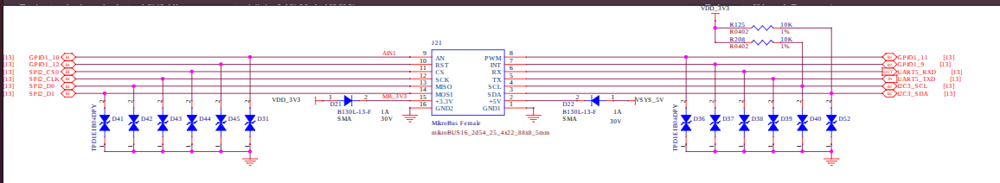

# Preconfigured Real-Time PTP (IEEE 1588) Grandmaster & Slave Architecture
This is an implementation of a time synchronization stack using a BeaglePlay (Grandmaster) and a BeagleBone Black (Slave) driven by a hardware GNSS/PPS reference source 
and running a `PREEMPT_RT` patched Linux kernel version 6.6.104.

This repository provides pre-configured, full-disk system images for the **BeaglePlay (Grandmaster)** and **BeagleBone Black (Slave)** that deploy a complete PTP (IEEE 1588) Real-Time Architecture out of the box. Engineered via `genimage`, each image bundles an automated `initramfs` boot phase with a high-performance, read-only `erofs` root filesystem. Upon power-on, the block image executes a hands-off initialization sequence: it builds the low-level hardware pinmux paths, settles network routing, and instantiates the PTP subsystem automatically with zero manual configuration required.

## Performance Metrics & Empirical Validation
System timing characteristics were validated via Emperically using a dual-channel oscilloscope.
[Oscilloscope Capture showing 65µs Context-Switch](images/image5.png)

---
## Hardware Used 
**Beagleplay and Beagboneblack**
**u-block NEO M9N GPS module**
**OpenHentek6022BL**

---

##  Hardware Architecture & Interface Mapping
To guarantee deterministic pin multiplexing across asynchronous reboots, Hardware pins are mapped directly to underlying peripheral controller addresses via custom Device Tree Binaries which were crosscompiled and put into the final image.

### 1. Grandmaster Node (BeaglePlay) Bus Configurations
The GNSS receiver interfaces via the physical MikroBUS expansion header:
* **NMEA Telemetry Data:** Routed via `UART5_RXD` / `UART5_TXD` exposed at `/dev/ttyS0`.
* **Hardware PPS Input:** Tied to `MIKROBUSGPIO1_9 of sys_interface or INT pin`, handling hardware interrupts via the kernel `pps-gpio` driver.
* **User-Space Pulser:** Tied to `MIKROBUSGPIO1_12 of sys_interface or RST pin` , modulated via the custom `pps-pulser.c` binary loop this uses ioctl interface.

### 2. Slave Node (BeagleBone Black) Header Configuration
* **P8_11 and P8_12 header pins are configured to be used by pps-driver for input and output via custom device tree binary**
* **P9_12 is used by ioctl for pps-pulser.c**

---

## Target Deployment
The pre-compiled full-disk binary images contain the cross-compiled `PREEMPT_RT` kernel, integrated device tree blobs, multi-stage bootloaders (TF-A, SPL, U-Boot), and the integrated network time daemons,for booting up the device press usr+rst button after flashing the image onto the SD card and correctly wireing up the GPS module, after that you might have to wait for a few mintues for the device to lock in. You can refer to the Implementation Docs inside the DOCs folder for debugging.This Implementation guide (Section 1 to 5) are heavily derived from Bootlin labmanuals for Beagleplay so for more detail you can check out [https://bootlin.com/]

1. Locate the compressed target binary images from the repository storage directory named **core-image** and **core-image-bbb**.
2. Write the raw structured disk image directly to the target block device (Replace `/dev/sdX` with your exact host MicroSD card interface node)
#### $ sudo dd if=core-image of=/dev/sdX {replace X with your sd card name}.
#### $ sudo dd if=core-image-bb of=/dev/sdX {for beagleboneblack}

Ip addresses are being configured at the start of the setup for beagleplay it is 192.168.0.100/24 and for beagleboneblack it is 192.168.0.102/24 which are being set in gm_start and setup_slave in the in usr/bin directory

## Mounting the disk images
If for some reason you need to access the disk image internals inorder to make some changes a config file for both the boards and the a way to mount the disk images is provided in this section you can modify the internals , but do remeber that after modyifing anything in the rootfile system or the kernel configuration those changes are needed to be made back into the orignal image somehow. 

### Mounting the disk images 
#### **$ sudo losetup -P /dev/loop31 output/core-image**

 provides a loop device to mount our core-image as a sudo external device  
#### **$ sudo mount /dev/loop31p1 /mnt/temp_sda1** 

 this mounts the uboot to the temp_sda1 beaglboneblack's uboot.env is in this partition
#### **$ sudo mount /dev/loop31p2 /mnt/temp_sda2**

mounts the devices ext4 partition that contains the kernel Image and device tree binary along with uboot.env for beaglplay

**$ mount -t erofs -o loop /dev/loop31p3 /mnt/temp_sda3/**

mounts the readonly rootfilesystem 
 
.config of both BBB and Beagleplay are in the config folder 
Inorder to make use of these simply copy these into the arch/arm/configs/ or arch/arm64/configs/ directory and then make with CROSS_COMPILE before running menuconfig. 

inorder to see how to remake the kernel you can follow the implementation guide in the DOCs folder

### pps-pulser.c

pps-pulser is a userspace program its job is simple it creates a timerfd that requires 3 parameters for its operations first is the delay after which it should start its execution , second the total time between consicutive pulses to the GPIO and the no. of times these pulses are to be created.
This program is for testing purposes only and serves no other purpose hence is statically build and can be deleted when required from /usr/bin directory of the image.
This program uses 1 GPIO pin which is accessed by ioctl v1 whose macros are defined at top incase it needs any type of changes.
Incase you do make some changes you are going to have to recompile it statically inorder to work which is also provided in the Implementation DOCs.

=
