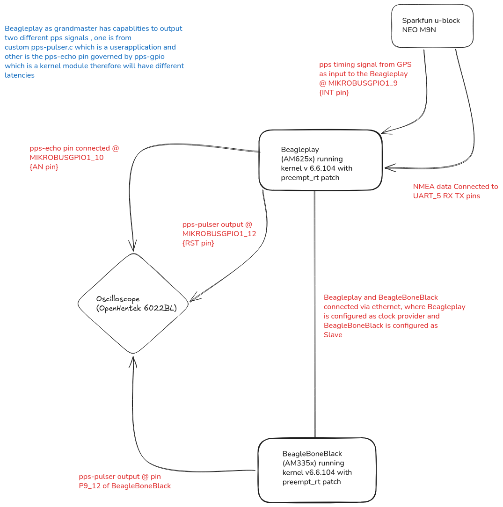
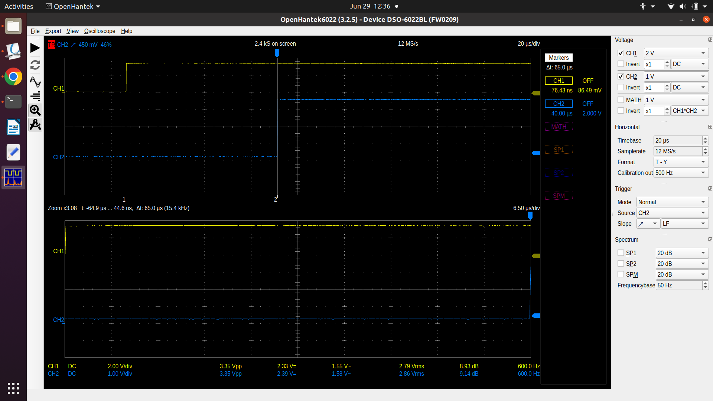
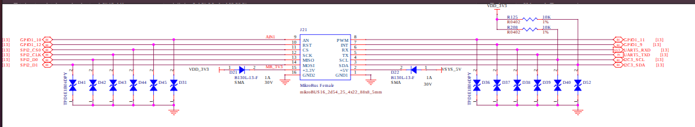

## Preconfigured Real-Time PTP (IEEE 1588) Grandmaster & Slave Architecture

This is an implementation of a time synchronization stack using a BeaglePlay (Grandmaster) and a BeagleBone Black (Slave) driven by a hardware GNSS/PPS reference source 
and running a `PREEMPT_RT` patched Linux kernel version 6.6.104.

This repository provides pre-configured, full-disk system images for the **BeaglePlay (Grandmaster)** and **BeagleBone Black (Slave)** that deploy a complete PTP (IEEE 1588) Real-Time Architecture out of the box. Engineered via `genimage`, each image bundles an automated `initramfs` boot phase with a high-performance, read-only `erofs` root filesystem. Upon power-on, the block image executes a hands-off initialization sequence: it builds the low-level hardware pinmux paths, settles network routing, and instantiates the PTP subsystem automatically with zero manual configuration required.

---
***System Architecture***

*Hardware topology and signal measurement flow for Grandmaster, Slave, and Oscilloscope verification.*

---
***Performance Metrics & Empirical Validation***

System timing characteristics were validated via empirically using a dual-channel oscilloscope.

This screenshot highlights the difference between the Grandmaster (Yellow) and Slave (Blue) timerfd outputs while the pps-echo pin was active. Beyond the increased delay between master and slave, notice that the pulse jitter is unpredictable, spiking as high as 20 µs.

This behaviour occurs because pps-echo operates as a kernel-space driver, actively consuming CPU cycles to generate echo pulses and causing execution contention for the user-space timerfd application so turning off echo pin which is activated via ppsctl inside the slave and grandmaster startup script in usr/bin is recommended in case using directly for deployment .

---
***Hardware Used***
* Beagleplay (AM625x)
* Beagboneblack (AM335x)
* u-block NEO M9N GPS module
* OpenHentek6022BL

---

***Hardware Architecture & Interface Mapping***

To guarantee deterministic pin multiplexing across asynchronous reboots, Hardware pins are mapped directly to underlying peripheral controller addresses via custom Device Tree Binaries which were crosscompiled and put into the final image.

***1. Grandmaster Node (BeaglePlay) Bus Configurations***
The GNSS receiver interfaces via the physical MikroBUS expansion header:
* **NMEA Telemetry Data:** Routed via `UART5_RXD` / `UART5_TXD` exposed at `/dev/ttyS0`.
* **Hardware PPS Input:** Tied to `MIKROBUSGPIO1_9 of sys_interface or INT pin`, handling hardware interrupts via the kernel `pps-gpio` driver.
* **User-Space Pulser:** Tied to `MIKROBUSGPIO1_12 of sys_interface or RST pin` , modulated via the custom `pps-pulser.c` binary loop this uses ioctl interface.

***2. Slave Node (BeagleBone Black) Header Configuration***
* `P8_11` and `P8_12` header pins are configured to be used by pps-driver for input and output via custom device tree binary
* `P9_12` is used by ioctl for pps-pulser.c

---
***Target Deployment***

The pre-compiled full-disk binary images contain the cross-compiled `PREEMPT_RT` kernel, integrated device tree blobs, multi-stage bootloaders (TF-A, SPL, U-Boot), and the integrated network time daemons,for booting up the device press usr+rst button after flashing the image onto the SD card and correctly wiring up the GPS module, after that you might have to wait for a few minutes for the device to lock in. You can refer to the Implementation Docs inside the DOCs folder for debugging.This Implementation guide (Section 1 to 5) are heavily derived from Bootlin labmanuals for Beagleplay so for more detail you can check out [Bootlin](https://bootlin.com/)

1. Locate the compressed target binary images from the repository storage directory named `core-image` and `core-image-bbb` [v1.0.0](https://github.com/parag155/PTP_Beagleplay-BBB/releases/tag/v1.0.0).
2. Write the raw structured disk image directly to the target block device (Replace `/dev/sdX` with your exact host MicroSD card interface node)

`$ sudo dd if=core-image of=/dev/sdX`

`$ sudo dd if=core-image-bbb of=/dev/sdX` 

Ip addresses are being configured at the start of the setup for beagleplay it is 192.168.0.100/24 and for beagleboneblack it is 192.168.0.102/24 which are being set in gm_start and setup_slave in the in usr/bin directory

---
***Mounting the disk images***

If for some reason you need to access the disk image internals in order to make some changes a config file for both the boards and the a way to mount the disk images is provided in this section you can modify the internals , but do remeber that after modifying anything in the rootfile system or the kernel configuration those changes are needed to be made back into the original image. 

`$ sudo losetup -P /dev/loop31 output/core-image`

 provides a loop device to mount our core-image as a sudo external device  
 
`$ sudo mount /dev/loop31p1 /mnt/temp_sda1`

 this mounts the uboot to the temp_sda1 beaglboneblack's uboot.env is in this partition

`$ sudo mount /dev/loop31p2 /mnt/temp_sda2`

mounts the devices ext4 partition that contains the kernel Image and device tree binary along with uboot.env for beaglplay

`$ mount -t erofs -o loop /dev/loop31p3 /mnt/temp_sda3/`

mounts the readonly rootfilesystem 
 
.config of both BBB and Beagleplay are in the config folder 
In order to make use of these simply copy these into the arch/arm/configs/ or arch/arm64/configs/ directory and then make with CROSS_COMPILE before running menuconfig. 

In order to see how to remake the kernel you can follow the implementation guide in the DOCs folder

---
***pps-pulser.c***

pps-pulser is a userspace testing utility that uses timerfd to generate GPIO pulses. It takes three operational parameters: the initial execution delay, the time interval between consecutive pulses, and the total pulse count.

The utility controls a single GPIO pin accessed via the ioctl v1 interface. Pin configurations are defined as macros at the top of the source file for easy modification.

Because it is strictly for testing, the program is statically built and can be safely deleted from /usr/bin when no longer needed. If you make any source code changes, you must recompile it statically, as described in the Implementation Docs.

---

*If these pre-configured real-time images or DTBs saved you debugging time on your BeaglePlay or BBB, please consider dropping a Star on the repository to help others find it!*
